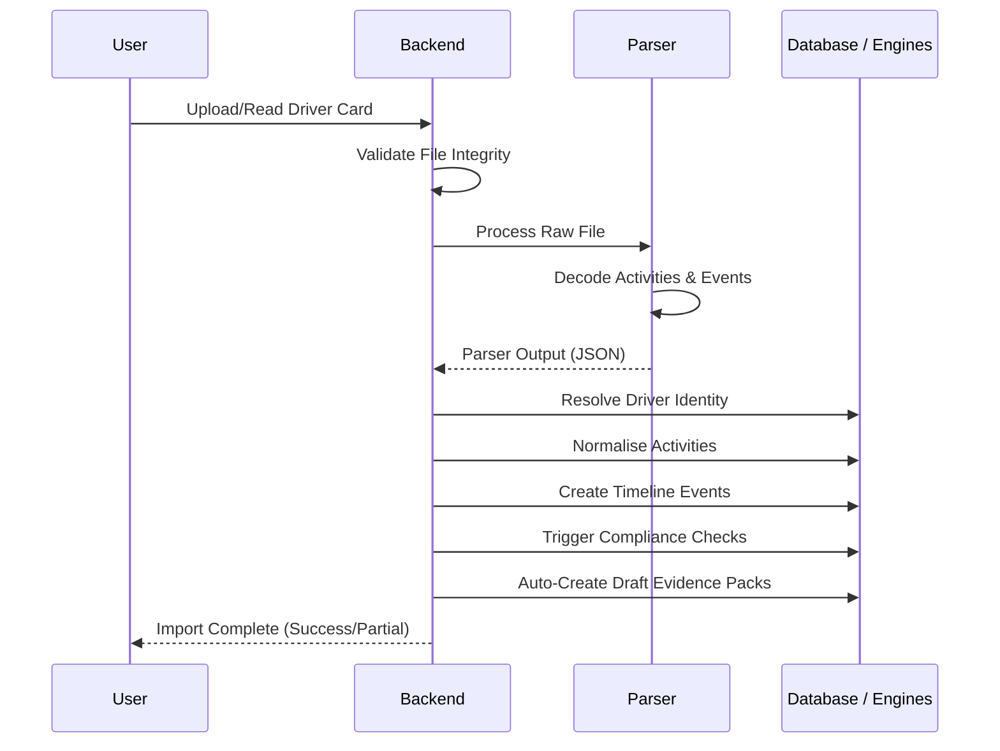

# 18.4 — Driver Card Engine

| Field         | Value                            |
| ------------- | -------------------------------- |
| **Subsystem** | Compliance Intelligence Platform |
| **Document**  | Driver Card Engine               |
| **Status**    | Living Document                  |
| **Priority**  | Critical                         |
| **Owner**     | Platform Architecture            |
| **Version**   | 1.0                              |

---

# Purpose

The Driver Card Engine is responsible for importing, validating, decoding and normalising data obtained from digital driver cards.

Its responsibility is to transform legally recorded tachograph information into structured operational evidence.

It does **not** calculate compliance.

It does **not** interpret legislation.

It extracts trusted facts.

---

# Responsibilities

The Driver Card Engine is responsible for:

* importing driver card data
* validating file integrity
* decoding activity records
* extracting metadata
* preserving original evidence
* creating timeline events
* publishing structured data

It is **not** responsible for:

* infringement detection
* legal interpretation
* reporting
* Atlas recommendations

Those belong to downstream components.

---

# Architectural Position

```text
Driver Card

↓

Import Pipeline

↓

Driver Card Engine

↓

Evidence Repository

↓

Timeline Engine

↓

Compliance Engine

↓

Atlas

↓

Reporting
```

---

# Supported Sources

## Manual Upload

Driver card export supplied by the user.

---

## Local Helper

HourWise desktop helper captures data from a connected smart-card reader.

The helper should be treated as an evidence acquisition mechanism.

Certification claims must only be made when technically and legally supported.

---

## Future Remote Download

Potential future support for remote driver card acquisition where legally permitted.

---

# Supported Formats

Current targets include:

* DDD
* C1B
* other supported industry formats where appropriate

The engine should identify format automatically where possible.

---

# Processing Pipeline



Each stage should be independently testable.

---

# Metadata Extraction

Typical metadata includes:

* card number
* issuing authority
* issuing country
* expiry date
* driver name
* licence identifiers where available
* activity date range
* file version
* download timestamp

Metadata should be searchable.

---

# Activity Extraction

The engine should decode activity records including:

* Driving
* Other Work
* Break
* Rest
* POA (where represented)
* Unknown or undefined periods
* Card insertion
* Card removal
* Manual entries
* Events
* Faults

The extracted activities should preserve their original order.

---

# Event Extraction

Events should be extracted separately from activities.

Examples include:

* card insertions
* card removals
* overspeed events
* power interruptions
* sensor events
* authentication events
* card conflicts
* calibration references

The engine stores events.

It does not interpret them.

---

# Normalisation

Decoded records should be converted into standard HourWise timeline structures.

The Timeline Engine should receive consistent event types regardless of source format.

Examples:

```text
Driving

Other Work

Break

Rest

POA

Event

Fault
```

Normalisation must preserve original timestamps.

---

# Original Evidence

Original uploads are immutable.

The engine should never modify:

* uploaded files
* timestamps
* encoded activity

Derived data should always reference the original evidence.

---

# Versioning

Different tachograph generations may produce different data structures.

The engine should identify:

* file version
* generation
* supported features
* unsupported features

Unsupported information should be preserved where practical for future processing.

---

# Error Handling

Errors should be classified.

## Validation Errors

Corrupt file.

Unsupported format.

Missing metadata.

Checksum failure.

---

## Decode Errors

Unexpected record.

Unknown activity.

Malformed structure.

Incomplete download.

---

## Storage Errors

Permission failure.

Storage unavailable.

Database failure.

---

## User Errors

Wrong file.

Duplicate upload.

Permission denied.

---

Every failure should produce a useful audit record.

---

# Duplicate Handling

Duplicate imports should be detected using:

* file hash
* card number
* activity period
* import timestamp

Duplicates should never generate duplicate compliance records.

---

# Timeline Publication

After successful decoding the engine publishes:

* activity events
* metadata
* event records
* evidence references

The Compliance Engine should never parse raw driver card files directly.

---

# Performance Goals

The engine should:

* process reliably
* minimise memory usage
* support large downloads
* recover safely from failure
* allow reprocessing

Performance is important.

Accuracy is more important.

---

# Security

Driver card data contains sensitive personal information.

Requirements include:

* authenticated uploads
* private storage
* encrypted transport
* company-scoped access
* audit logging
* secure deletion policies where permitted
* GDPR compliance

---

# Testing Requirements

Testing should include:

* valid driver cards
* intentionally corrupted files
* duplicate uploads
* unsupported versions
* incomplete downloads
* parser regression tests
* timestamp verification
* timezone handling
* long activity periods
* edge-case events

A library of anonymised or synthetic test files should be maintained wherever legally possible.

---

# Parser Strategy

The Driver Card Engine should separate:

* file reading
* decoding
* normalisation

This allows parser implementations to change without affecting downstream components.

Parser libraries are implementation details.

The HourWise data model remains stable.

---

# Explainability

Every extracted activity should remain traceable back to:

* original upload
* record position where available
* parser version
* processing run

This supports debugging and audit confidence.

---

# Engineering Rules

The Driver Card Engine must never:

* calculate infringements
* estimate missing activities without clearly marking them
* overwrite original evidence
* silently ignore unknown records
* modify timestamps
* discard unsupported data without logging it

Unknown information should be preserved wherever practical.

---

# Future Enhancements

Potential future developments include:

* support for additional tachograph generations
* improved parser abstraction
* remote card download
* automatic parser validation
* parser comparison mode
* integrity confidence scoring
* import diagnostics
* advanced metadata extraction

---

# Definition of Done

The Driver Card Engine is complete when:

* files are validated
* metadata is extracted
* activities are decoded
* events are decoded
* original evidence is preserved
* timeline events are published
* duplicate detection works
* audit events are created
* parser regression tests pass
* unsupported records are handled safely

---

# Related Documents

- [18.3 — Evidence Import Pipeline.md](./18.3%20—%20Evidence%20Import%20Pipeline.md) — provides the files for decoding.
- [18.6 — Timeline Engine.md](./18.6%20—%20Timeline%20Engine.md) — consumes the normalised activities to create **Timeline Events**.
- [18.7 — Compliance Engine.md](./18.7%20—%20Compliance%20Engine.md) — applies rules to the resulting timeline.
- [18.8 — Evidence Engine.md](./18.8%20—%20Evidence%20Engine.md) — preserves the raw card files as primary **Source Records**.
- [21 — Data Model Specification.md](./21%20—%20Data%20Model%20Specification.md) — defines `driver_card_imports` and **Parser Output** storage.
