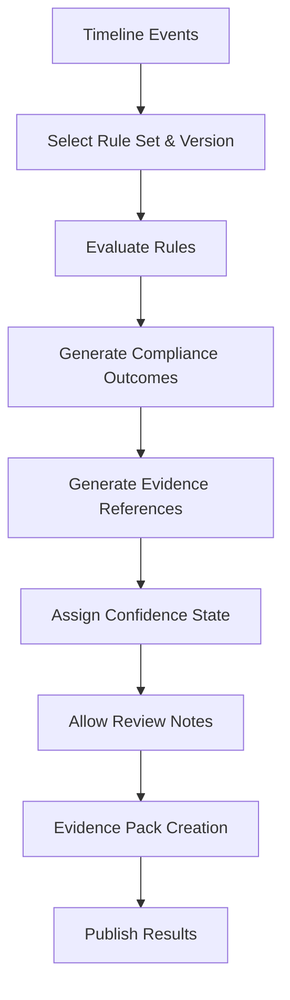

# 18.7 — Compliance Engine

| Field         | Value                            |
| ------------- | -------------------------------- |
| **Subsystem** | Compliance Intelligence Platform |
| **Document**  | Compliance Engine                |
| **Status**    | Living Document                  |
| **Priority**  | Critical                         |
| **Owner**     | Platform Architecture            |
| **Version**   | 1.0                              |

---

# Purpose

The Compliance Engine is responsible for applying legislation and company policy to the unified operational history of **Timeline Events**.

It is the legal interpretation layer of the Compliance Intelligence Platform.

The Compliance Engine never reads raw tachograph files.

It never decodes Driver Cards.

It never analyses Vehicle Units directly.

It consumes a unified timeline of trusted events and applies deterministic rules.

---

## Core Philosophy

The Compliance Engine answers one question:

> **"Given these verified Timeline Events, what are the Compliance Outcomes?"**

It should never answer:

> "What happened?"

That question has already been answered by the Timeline Engine.

---

# Responsibilities

The Compliance Engine is responsible for:

* rule evaluation
* compliance calculations
* infringement detection
* legal warnings
* operational warnings
* risk indicators
* compliance summaries
* evidence references

It is **not** responsible for:

* evidence collection
* file parsing
* event ordering
* AI recommendations
* report formatting

---

# Implemented Capabilities

The Compliance Engine implements:

* **CMP-001**: Drivers' Hours Rules
* **CMP-002**: Working Time Rules
* **CMP-003**: Infringement Detection
* **INT-001**: Atlas Rule Engine (Primary Evaluation)
* **SYS-003**: Background Jobs (Evaluation Runs)

---

## Guiding Principles

### Deterministic

Given the same **Timeline Events** and **Ruleset Version**, the Compliance Engine must always produce the same **Compliance Outcome**.

---

## Explainable

Every compliance decision must explain:

* rule applied
* evidence used
* calculation performed
* resulting outcome

---

## Versioned

Compliance calculations must record:

* ruleset version
* calculation version
* processing timestamp

This allows historical reports to be reproduced accurately.

---

## Evidence-Based

No decision may exist without supporting evidence.

If evidence is missing, the engine should identify uncertainty rather than invent facts.

---

# Rule Categories

The engine should support multiple rule groups.

## Drivers' Hours

Driving limits

Breaks

Daily driving

Weekly driving

Fortnightly driving

Rest requirements

Compensation requirements

---

## Working Time

Working periods

Break entitlement

Night work

Reference periods

Average working time

---

## Company Policy

Custom configurable rules.

Examples:

* maximum shift length
* vehicle inspection deadlines
* document expiry
* internal safety rules

These must remain clearly distinguishable from legislation.

---

## Operational Rules

Examples:

* missing vehicle check
* outstanding defects
* overdue reports
* expired documents

Operational rules are not legal infringements.

---

# Rule Evaluation Pipeline

The engine should remain independent of evidence acquisition.

---

## Compliance Outcomes

Every rule evaluation may produce a **Compliance Outcome**:

* compliant
* warning
* advisory
* infringement
* policy breach
* informational

Each **Compliance Outcome** should include supporting evidence.

---

# Infringement Model

Every infringement should contain:

* unique identifier
* rule reference
* legislation reference
* severity
* start time
* end time
* evidence references
* explanation
* calculation details
* processing version

---

# Rule Versioning

Legislation changes.

The Compliance Engine must support multiple rule versions.

Historical calculations should remain reproducible using the rules that applied at the time.

Rule versioning should never overwrite previous results.

---

# Jurisdiction Support

The architecture should support multiple jurisdictions.

Examples:

* United Kingdom
* European Union
* future international support

Rulesets should remain modular.

---

# Rule Independence

Individual rules should remain independent where possible.

Changing one rule should not require rewriting the entire engine.

Examples:

Driving Time Rule

Break Rule

Daily Rest Rule

Weekly Rest Rule

Working Time Rule

Document Expiry Rule

Each rule should be individually testable.

---

# Evidence References

Every compliance outcome must reference:

* timeline events
* evidence identifiers
* original uploads
* processing version

This supports investigations and audits.

---

# Confidence

The Compliance Engine should distinguish between:

Confirmed outcome

Likely outcome

Incomplete evidence

Manual review required

Confidence should never hide uncertainty.

---

## Manual Review

Some situations require human judgement via **Review Notes**.

Examples:

Missing downloads

Incomplete records

Conflicting evidence

Unresolved driver identity

Unsupported activity

The engine should identify these situations without making assumptions.

---

# Company Policies

Company policy rules should never be presented as legal infringements.

The interface must clearly distinguish:

Legal Requirement

Company Policy

Operational Recommendation

Atlas Insight

---

# Rule Configuration

Rule configuration should support:

enabled

disabled

effective date

jurisdiction

company policy

version

Rule changes should generate audit events.

---

# Performance Goals

The engine should support:

large fleets

historical recalculation

rule version comparison

batch processing

incremental recalculation

Performance must never compromise correctness.

---

# Security

Rule processing should be:

authenticated

company-scoped

auditable

reproducible

tamper resistant

Rule changes require appropriate permissions.

---

# Explainability

Every compliance decision should answer:

Which rule was applied?

Why?

Which evidence was used?

Which legislation applies?

How was the calculation performed?

What should happen next?

---

# Engineering Rules

The Compliance Engine must never:

modify evidence

reorder timeline events

guess missing data

invent activities

overwrite previous rule versions

perform AI reasoning

Its responsibility is deterministic rule evaluation.

---

# Relationship to Atlas

Atlas consumes compliance results.

Atlas may:

explain

prioritise

summarise

recommend

predict

Atlas must not alter compliance calculations.

Compliance remains the authoritative source.

---

# Future Enhancements

Future developments include:

additional jurisdictions

company rule builder

rule simulation

"What if?" analysis

legislation update service

driver coaching recommendations

predictive compliance

real-time compliance evaluation

---

# Testing Strategy

Every rule should have:

unit tests

edge case tests

regression tests

historical examples

synthetic examples

known legal scenarios

Real-world anonymised examples should be added whenever available.

---

# Definition of Done

The Compliance Engine is complete when:

rules are deterministic

calculations are reproducible

versioning works

evidence references exist

manual review scenarios are identified

jurisdiction support exists

company policy separation works

rule testing passes

audit history is preserved

---

# Relationship to Other Engines

## Driver Card Engine

Extracts driver evidence.

## Vehicle Unit Engine

Extracts vehicle evidence.

## Timeline Engine

Creates chronological truth.

## Compliance Engine

Applies legislation.

## Atlas

Provides operational intelligence.

Each layer has a single responsibility.

---

# Related Documents

- [18.6 — Timeline Engine.md](./18.6%20—%20Timeline%20Engine.md) — provides the unified operational history of **Timeline Events**.
- [18.8 — Evidence Engine.md](./18.8%20—%20Evidence%20Engine.md) — stores **Evidence Packs** linked to **Compliance Outcomes**.
- [18.9 — Evidence & Reporting Engine.md](./18.9%20—%20Evidence%20&%20Reporting%20Engine.md) — transforms outcomes into professional reports.
- [21 — Data Model Specification.md](./21%20—%20Data%20Model%20Specification.md) — defines `compliance_outcomes`, `rule_versions`, and `compliance_checks`.
