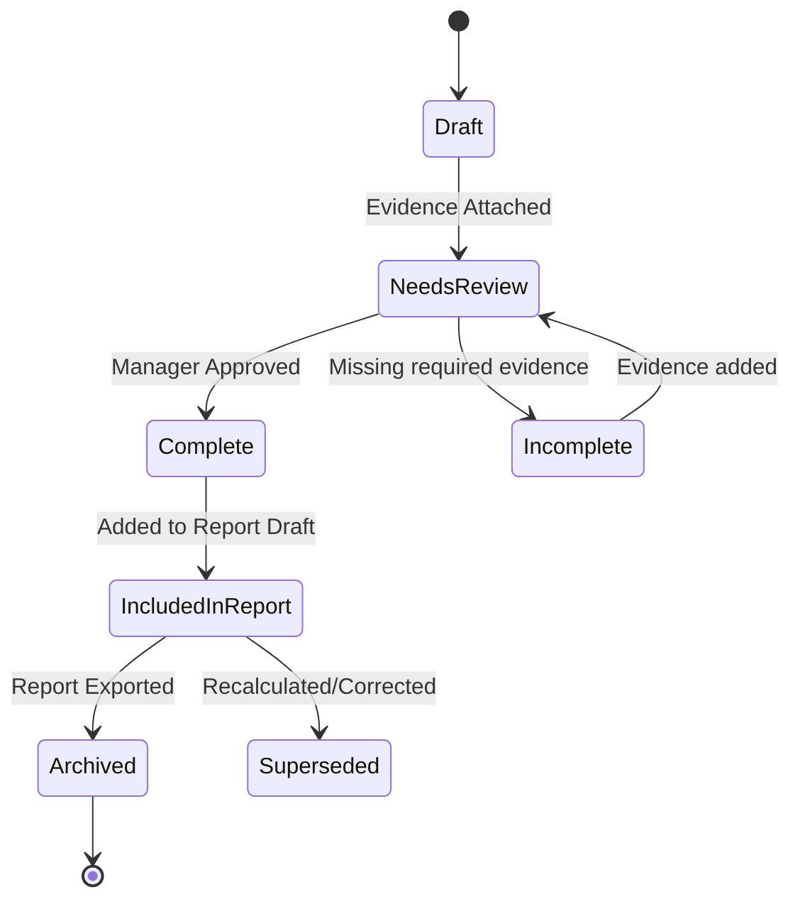

# 18.8 — Evidence Engine

| Field         | Value                            |
| ------------- | -------------------------------- |
| **Subsystem** | Compliance Intelligence Platform |
| **Document**  | Evidence Engine                  |
| **Status**    | Living Document                  |
| **Priority**  | Critical                         |
| **Owner**     | Platform Architecture            |
| **Version**   | 1.0                              |

---

# Purpose

The Evidence Engine is responsible for preserving, organising, classifying and referencing every piece of operational evidence used by the HourWise Platform.

It is the authoritative source of truth for evidence.

Its responsibility is not to interpret evidence.

Its responsibility is to preserve it.

---

# Definition of Evidence

Evidence is any information that supports, explains or verifies an operational event or compliance decision.

Evidence may originate from:

* Driver Cards
* Vehicle Units
* Driver App
* Fleet Portal
* Uploaded documents
* Photographs
* GPS
* Future telematics
* Future integrations

The source is less important than the evidence itself.

---

# Philosophy

Evidence is permanent.

Interpretation may change.

Reports may change.

Legislation may change.

Atlas may improve.

The evidence should remain unchanged.

---

# Implemented Capabilities

The Evidence Engine implements:

* **CMP-004**: Compliance Evidence (Authoritative Source)
* **CORE-005**: Audit Trail (Chain of Evidence)
* **SYS-001**: Security Model (Encryption at Rest/Auth Access)
* **CMP-007**: O-Licence Readiness (Partial - Evidence Aggregation)

It is **not** responsible for:

* compliance calculations
* timeline ordering
* AI recommendations
* report formatting

---

# Evidence Categories

The platform should recognise multiple categories.

## Primary Evidence

Original uploaded files.

Examples:

* Driver Card
* Vehicle Unit
* Original documents

Highest authority.

---

## Operational Evidence

Records generated by the platform.

Examples:

* Driver App shifts
* Vehicle checks
* Defect reports
* Incident reports
* Expenses

---

## Administrative Evidence

Supporting documentation.

Examples:

* CPC
* Driving licence
* Insurance
* Maintenance records
* Calibration certificates
* Company policies

---

## Analytical Evidence

Derived but reproducible outputs.

Examples:

* Timeline events
* Compliance outcomes
* Risk scores
* Atlas summaries

These should always reference the original evidence that supports them.

---

# Evidence Pack Lifecycle



Every evidence item follows a defined lifecycle.

```text
Created

↓

Validated

↓

Stored

↓

Referenced

↓

Consumed

↓

Archived

↓

Retained

↓

Deleted (only where legally permitted)
```

The original evidence should remain immutable wherever practical.

---

# Evidence Identity

Every evidence item should receive a permanent identifier.

Example:

```text
EVD-000000123
```

Evidence IDs should never be reused.

---

# Evidence Metadata

Every evidence item should include:

* Evidence ID
* Evidence Type
* Source
* Created Date
* Uploaded Date
* Owner
* Company
* Driver
* Vehicle
* Related Import
* Processing Version
* Storage Location
* Hash
* Retention Policy
* Confidence
* Status

---

# Evidence Provenance

Every evidence item should answer:

Where did this come from?

Who uploaded it?

When was it created?

Has it changed?

Which processing version used it?

Which reports reference it?

---

# Integrity

Evidence integrity should be verifiable.

Examples:

* SHA-256 hash
* upload timestamp
* storage audit
* immutable storage where appropriate

Integrity failures should trigger investigation.

---

# Relationships

Evidence may relate to:

Driver

Vehicle

Journey

Incident

Defect

Expense

Timeline Event

Compliance Outcome

Report

Atlas Recommendation

Evidence should support many-to-many relationships.

---

# Chain of Evidence

Every compliance outcome should support a complete chain.

```text
Original Upload

↓

Evidence Record

↓

Timeline Event

↓

Compliance Result

↓

Atlas Recommendation

↓

Report

↓

Audit Pack
```

Nothing should become disconnected.

---

# Retention

Retention should be configurable.

Examples:

* legal minimum
* company policy
* jurisdiction

Expired evidence should never disappear without audit records.

---

# Retrieval

Evidence should be searchable by:

Driver

Vehicle

Company

Date

Evidence Type

Import

Report

Timeline Event

Compliance Result

Incident

Document

---

# Security

Evidence is sensitive.

Requirements:

* authenticated access
* company isolation
* encryption in transit
* encryption at rest
* audit logging
* access history
* secure deletion
* retention controls

---

# Explainability

Every report should identify the evidence used.

Every Atlas recommendation should identify the evidence used.

Every compliance calculation should identify the evidence used.

Nothing should appear unsupported.

---

# Engineering Rules

The Evidence Engine must never:

modify original evidence

delete evidence without policy

calculate compliance

guess missing information

invent evidence

Evidence remains factual.

---

# Future Enhancements

Future improvements include:

digital signatures

evidence confidence scoring

OCR extraction

automatic classification

external evidence ingestion

evidence deduplication

legal hold

chain-of-custody reporting

---

# Definition of Done

The Evidence Engine is complete when:

evidence IDs are permanent

provenance is preserved

relationships work

hashes are stored

search works

retrieval works

audit history exists

security controls pass

retention policies work

original evidence remains immutable

---

# Related Documents

- [18.7 — Compliance Engine.md](./18.7%20—%20Compliance%20Engine.md) — generates the **Compliance Outcomes** that require evidence.
- [18.9 — Evidence & Reporting Engine.md](./18.9%20—%20Evidence%20&%20Reporting%20Engine.md) — includes **Evidence Packs** in generated reports.
- [19 — Atlas Specification.md](./19%20—%20Atlas%20Specification.md) — uses evidence to explain compliance recommendations.
- [21 — Data Model Specification.md](./21%20—%20Data%20Model%20Specification.md) — defines `evidence_packs` and `evidence_items`.
