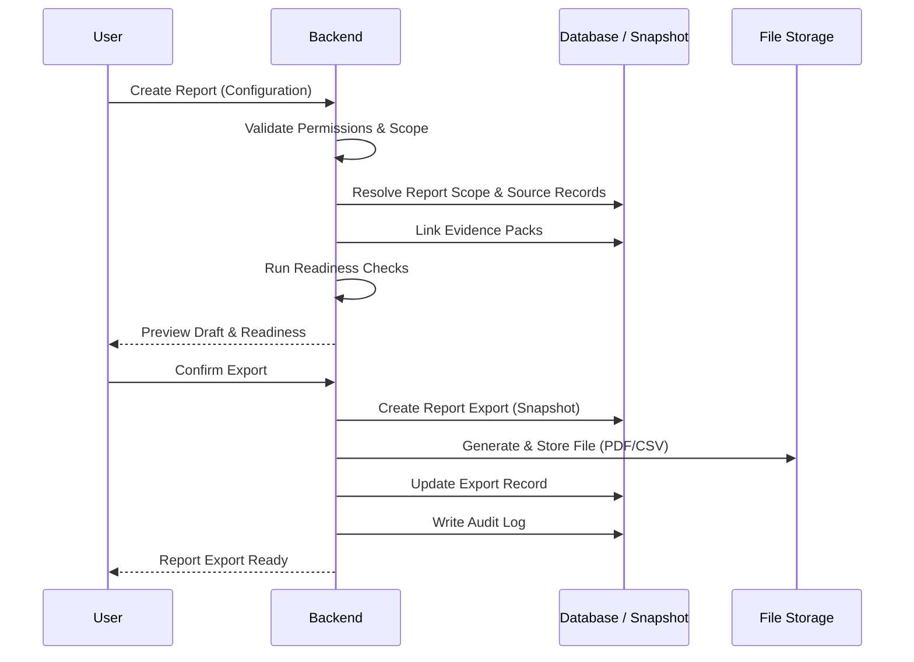

# 20 — Reporting Platform Specification

## Related Documents

- [18.8 — Evidence Engine.md](./18.8%20—%20Evidence%20Engine.md) — provides the **Evidence Packs** for report inclusion.
- [19 — Atlas Specification.md](./19%20—%20Atlas%20Specification.md) — provides the intelligence layer for explaining **Readiness State**.
- [21 — Data Model Specification.md](./21%20—%20Data%20Model%20Specification.md) — defines the `reports` and **Report Export** (snapshot) tables.
- [22 — Security Model Specification.md](./22%20—%20Security%20Model%20Specification.md) — defines the permission and RLS requirements for report access.

---

## 1. Purpose

This document defines the HourWise Reporting Platform.

The Reporting Platform is responsible for turning trusted HourWise compliance data into structured, reviewable, exportable reports.

Reports must be based on:

* imported driver card data
* imported vehicle unit data
* **Parser Outputs**
* normalised **Timeline Events**
* **Compliance Outcomes**
* **Evidence Packs**
* **Review Notes**
* fleet records
* driver records
* vehicle records
* report configuration
* audit logs

The Reporting Platform must help fleet operators, transport managers, and compliance administrators prepare professional evidence-backed reports without weakening the integrity of the underlying data.

---

## 2. Core Principle

The core principle of HourWise reporting is:

> Reports must snapshot evidence as a **Report Export**, not simply display live data.

A report should represent what was known, reviewed, and exported at a specific point in time.

This is important because underlying data may later change due to:

* new imports
* corrected files
* reprocessed **Parser Output**
* recalculated **Compliance Outcomes**
* added **Review Notes**
* matched vehicle unit data
* resolved evidence gaps

A generated report must remain auditable even if the live data later changes.

---

## 3. Reporting Platform Goals

The Reporting Platform should:

* create clear compliance reports
* support internal management review
* support audit preparation
* summarise driver and vehicle compliance
* show evidence behind findings
* identify missing or incomplete records
* support review workflows
* export professional documents
* preserve report history
* maintain permission boundaries
* integrate with Atlas
* avoid unsupported legal conclusions

Reports should be useful for day-to-day transport management, not just formal audits.

---

## 4. Non-Goals

The Reporting Platform must not:

* replace legal advice
* act as an enforcement authority
* hide unresolved compliance outcomes
* edit raw tachograph data
* override compliance calculations
* delete evidence after export
* silently finalise reports
* send reports without confirmation
* allow unauthorised access
* generate disciplinary notices automatically
* claim a fleet is “guaranteed compliant”
* present incomplete evidence as complete

Reports should support human review and decision-making.

---

## 5. Report Types

The platform should support multiple report types over time.

### 5.1 MVP Report Types

The MVP should focus on a smaller set of high-value reports.

Required MVP report types:

* Driver Compliance Report
* Vehicle Compliance Report
* Evidence Pack Report
* Monthly Fleet Compliance Summary
* Missing Data Report
* Failed Import Report

### 5.2 Future Report Types

Future report types may include:

* Driver Infringement Report
* Working Time Report
* Weekly Driving Time Report
* Fortnightly Driving Time Report
* Daily Rest Report
* Reduced Rest Report
* Overspeed Report
* Unknown Driver Activity Report
* Movement Without Card Report
* Vehicle Unit Download Report
* Driver Card Download Report
* Audit Preparation Pack
* Manager Action Report
* Fleet Risk Trend Report
* Depot Compliance Report
* FORS / EcoStars / SQAS support reports
* Passenger Transport Compliance Report
* Driver Acknowledgement Report

---

## 6. Report Lifecycle

Reports should follow a clear lifecycle.

```text
Draft
  ↓
In Review
  ↓
Ready to Export
  ↓
Exported
  ↓
Archived
```

Optional exceptional states:

```text
Blocked
Superseded
Cancelled
Failed Export
```

### 6.1 Report Draft

A **Report Draft** has been created but has not yet been fully reviewed.

**Report Drafts** may contain:

* unresolved outcomes
* incomplete evidence packs
* missing review notes
* failed imports
* warnings

### 6.2 In Review

A report is in active review by an authorised user.

This state may be used when a transport manager or compliance administrator is checking the report before export.

### 6.3 Ready to Export

A report is ready when:

* all required sections are present
* required evidence packs are linked
* blocking failed imports are resolved or acknowledged
* required review notes are complete
* unresolved issues are clearly marked
* the user has permission to export

Ready does not mean “no issues exist”.

It means the report is sufficiently prepared for export.

### 6.4 Report Export

A **Report Export** has been generated into a final output format.

At export time, the system must snapshot:

* report configuration
* included records
* evidence pack state
* compliance outcome state
* review notes
* export user
* export timestamp
* report version
* file metadata

### 6.5 Archived

Archived reports are retained for reference.

Archived reports should remain readable unless retention policy or deletion rules require otherwise.

### 6.6 Superseded

A report may be marked superseded when a newer report replaces it.

The original report should not be deleted.

---

## 7. Report Readiness

Report readiness must be calculated from system records.

Atlas may explain readiness, but the Reporting Platform should provide the underlying readiness status.

### 7.1 Readiness States

Recommended readiness states:

* `draft`
* `needs_review`
* `blocked`
* `ready_to_export`
* `exported`
* `superseded`
* `archived`

### 7.2 Readiness Checks

Readiness checks may include:

* all required imports processed
* no blocking failed imports
* required evidence packs created
* required evidence packs complete or acknowledged
* compliance outcomes linked
* unresolved outcomes marked clearly
* manager review notes added where required
* report date range valid
* report sections populated
* export permission available

### 7.3 Blocking Issues

Examples of blocking issues:

* failed import within report period
* missing driver card data for required period
* missing vehicle unit data where required
* evidence pack marked incomplete
* unresolved parser error
* missing driver or vehicle identity
* unsupported file type
* permission failure
* report configuration error

### 7.4 Non-Blocking Warnings

Examples of warnings:

* optional VU confirmation not available
* review note recommended but not required
* driver has incomplete profile data
* vehicle registration changed during period
* report contains possible outcomes
* report contains uncertain outcomes
* report generated before all future scheduled downloads are complete

Warnings must be visible.

They must not be hidden to make a report appear cleaner.

---

## 8. Evidence Snapshotting

Evidence snapshotting is one of the most important reporting requirements.

### 8.1 Why Snapshotting Exists

Live compliance data may change.

For example:

1. A report is exported on 1 July.
2. A missing VU file is uploaded on 3 July.
3. Compliance outcomes are recalculated.
4. The live evidence state changes.

The exported 1 July report must still show what was known at the time of export.

### 8.2 Snapshot Contents

A report snapshot should include:

* report metadata
* report template version
* export timestamp
* exporting user
* fleet ID
* date range
* included driver IDs
* included vehicle IDs
* included import IDs
* included parser output IDs
* included timeline event IDs
* included compliance outcome IDs
* included evidence pack IDs
* included review note IDs
* readiness state at export
* unresolved issue list
* warning list
* generated file metadata

### 8.3 Snapshot Strategy

The system may snapshot by storing:

* full copied report data
* references plus immutable version IDs
* generated export file
* report JSON payload used for rendering

Recommended approach:

* store the generated report payload
* store source record references
* store version metadata
* store exported file metadata

This allows reports to be reproduced and audited.

---

## 9. Report Sections

Reports should be built from structured sections.

### 9.1 Standard Sections

Common report sections:

* Cover Page
* Report Metadata
* Fleet Summary
* Date Range
* Driver Summary
* Vehicle Summary
* Compliance Outcomes
* Evidence Summary
* Missing Data
* Review Notes
* Manager Actions
* Appendix
* Export Audit Details

### 9.2 Driver Compliance Report Sections

A Driver Compliance Report should include:

* driver name
* driver identifier
* card number where appropriate
* report date range
* driver card imports included
* timeline summary
* driving totals
* work/rest summary
* compliance outcomes
* evidence packs
* missing data
* review notes
* manager action list
* export metadata

### 9.3 Vehicle Compliance Report Sections

A Vehicle Compliance Report should include:

* vehicle registration
* vehicle identifier
* VU imports included
* report date range
* vehicle activity summary
* matched drivers
* unknown driver periods
* movement without card
* overspeed events if supported
* mileage gaps
* evidence packs
* missing data
* review notes
* export metadata

### 9.4 Evidence Pack Report Sections

An Evidence Pack Report should include:

* evidence pack ID
* linked compliance outcome
* source records
* timeline events
* import records
* evidence completeness state
* missing evidence
* review notes
* report inclusion history
* audit metadata

### 9.5 Monthly Fleet Compliance Summary Sections

A Monthly Fleet Compliance Summary should include:

* fleet name
* reporting month
* total drivers included
* total vehicles included
* imports processed
* failed imports
* confirmed outcomes
* possible outcomes
* outcomes needing review
* incomplete evidence packs
* reports generated
* manager action list
* Atlas summary if used
* export metadata

---

## 10. Compliance Outcome Handling

Reports must handle compliance outcomes carefully.

### 10.1 Outcome Statuses

Reports should distinguish:

* confirmed outcome
* possible outcome
* uncertain outcome
* insufficient data
* resolved after review
* superseded by recalculation
* dismissed with review note

### 10.2 Wording Rules

Reports should avoid unsupported enforcement language.

Preferred wording:

* “flagged for review”
* “possible issue”
* “confirmed by available evidence”
* “requires manager review”
* “insufficient data”
* “evidence incomplete”
* “calculated outcome”

Avoid:

* “driver broke the law”
* “illegal activity”
* “guilty”
* “guaranteed infringement”
* “audit pass guaranteed”
* “no risk”

### 10.3 Manager Review Notes

Where a human review changes the interpretation of an outcome, the report should include the review note.

The system should preserve:

* original calculated outcome
* review note
* reviewing user
* review timestamp
* current report treatment

---

## 11. Missing Data Reporting

Missing data must be visible and explainable.

### 11.1 Missing Data Types

Reports should be able to show:

* missing driver card import
* missing vehicle unit import
* failed parser output
* timeline gap
* unmatched vehicle activity
* missing review note
* incomplete evidence pack
* unknown driver period
* unsupported file type
* duplicate rejected file
* incomplete driver profile
* incomplete vehicle profile

### 11.2 Missing Data Severity

Recommended severity levels:

* `info`
* `warning`
* `needs_review`
* `blocking`

### 11.3 Missing Data Example

```text
Missing Data:
Vehicle unit confirmation has not been imported for vehicle HW12 ABC between 12 June 2026 and 14 June 2026.

Severity: Needs Review
Effect: Related compliance outcomes remain possible rather than confirmed.
Recommended action: Import or match the relevant VU file before final export.
```

---

## 12. Report Builder

The Report Builder is the user interface for creating and managing reports.

### 12.1 Report Builder Requirements

The Report Builder should allow authorised users to:

* select report type
* select fleet/depot scope
* select date range
* select drivers
* select vehicles
* preview included records
* view readiness status
* view blocking issues
* view warnings
* view linked evidence packs
* add or review notes
* ask Atlas for help
* generate draft
* export final report

### 12.2 Report Builder Steps

Recommended flow:

```text
Choose Report Type
  ↓
Choose Scope
  ↓
Choose Date Range
  ↓
Review Included Records
  ↓
Check Evidence and Readiness
  ↓
Review Draft
  ↓
Export
```

### 12.3 Report Builder UI Components

Suggested components:

* report type selector
* scope selector
* date range picker
* driver selector
* vehicle selector
* readiness panel
* evidence pack list
* blocking issue list
* warning list
* preview panel
* Atlas help panel
* export controls
* report history panel

---

## 13. Atlas Integration

Atlas should support reporting, but not control reporting autonomously.

### 13.1 Atlas May Help With

Atlas may:

* explain report readiness
* list unresolved issues
* summarise evidence packs
* identify missing records
* draft report summaries
* draft manager notes
* suggest next review steps
* explain why export is blocked
* prepare a report checklist

### 13.2 Atlas Must Not

Atlas must not:

* export a report without confirmation
* send a report without confirmation
* hide unresolved issues
* mark a report ready if readiness checks fail
* invent evidence
* rewrite findings to look better
* provide legal guarantees

### 13.3 Example Atlas Reporting Prompt

User:

> Is this monthly report ready to export?

Atlas:

> “This report is not ready to export.
>
> Blocking issues:
>
> * 1 failed driver card import
> * 2 incomplete evidence packs
>
> Warnings:
>
> * 3 outcomes remain marked Needs Review
>
> Recommended action: resolve the failed import and review the incomplete evidence packs before exporting.”

---

## 14. Export Formats

### 14.1 MVP Export Formats

MVP should support:

* PDF export
* CSV export for tabular data where useful

### 14.2 Future Export Formats

Future formats may include:

* XLSX
* DOCX
* JSON
* ZIP audit pack
* signed PDF
* scheduled email attachment
* API export

### 14.3 PDF Requirements

PDF reports should be:

* professional
* readable
* branded
* timestamped
* paginated
* export-versioned
* suitable for printing
* clear about unresolved items
* clear about evidence status

### 14.4 CSV Requirements

CSV exports should be used for structured tabular information such as:

* imports
* outcomes
* driver totals
* vehicle totals
* missing data
* manager actions

CSV should not be the only format for narrative compliance reports.

---

## 15. Report Templates

Reports should be generated from templates.

### 15.1 Template Metadata

Each template should have:

* template ID
* report type
* version
* title
* description
* supported output formats
* required sections
* optional sections
* created timestamp
* active status

### 15.2 Template Versioning

Template versions matter because report formatting and included sections may change.

An exported report should record the template version used.

### 15.3 MVP Templates

Initial templates:

* `driver_compliance_v1`
* `vehicle_compliance_v1`
* `evidence_pack_v1`
* `monthly_fleet_summary_v1`
* `missing_data_v1`
* `failed_import_v1`

---

## 16. Report Configuration

Report configuration should be explicit.

Configuration may include:

* report type
* date range
* fleet ID
* depot ID
* included drivers
* included vehicles
* included evidence packs
* included outcome severities
* include resolved outcomes
* include possible outcomes
* include missing data
* include review notes
* include Atlas summaries
* output format
* branding options

Example:

```json
{
  "report_type": "monthly_fleet_summary",
  "fleet_id": "fleet_123",
  "date_range": {
    "start": "2026-06-01",
    "end": "2026-06-30"
  },
  "include_possible_outcomes": true,
  "include_missing_data": true,
  "include_review_notes": true,
  "output_format": "pdf"
}
```

---

## 17. Data Model

Detailed database design will be finalised in `21_Data_Model_Specification.md`.

This section defines the reporting-related entities required.

### 17.1 `reports`

Stores report records.

Suggested fields:

* `id`
* `fleet_id`
* `depot_id`
* `created_by`
* `report_type`
* `title`
* `description`
* `date_range_start`
* `date_range_end`
* `status`
* `readiness_state`
* `template_id`
* `template_version`
* `configuration_json`
* `created_at`
* `updated_at`

### 17.2 `report_sections`

Stores structured report sections.

Suggested fields:

* `id`
* `report_id`
* `section_key`
* `section_title`
* `section_order`
* `content_json`
* `status`
* `created_at`
* `updated_at`

### 17.3 `report_sources`

Stores source records included in the report.

Suggested fields:

* `id`
* `report_id`
* `source_type`
* `source_id`
* `source_version`
* `included_reason`
* `created_at`

### 17.4 `report_evidence_packs`

Links reports to evidence packs.

Suggested fields:

* `id`
* `report_id`
* `evidence_pack_id`
* `inclusion_status`
* `created_at`

### 17.5 `report_exports`

Stores generated exports.

Suggested fields:

* `id`
* `report_id`
* `exported_by`
* `export_format`
* `file_path`
* `file_hash`
* `file_size`
* `snapshot_json`
* `export_status`
* `exported_at`

### 17.6 `report_readiness_checks`

Stores readiness check results.

Suggested fields:

* `id`
* `report_id`
* `check_key`
* `check_result`
* `severity`
* `message`
* `source_type`
* `source_id`
* `created_at`

### 17.7 `report_templates`

Stores report template metadata.

Suggested fields:

* `id`
* `template_key`
* `version`
* `report_type`
* `title`
* `description`
* `schema_json`
* `is_active`
* `created_at`

---

## 18. Permissions

Reporting must be permission-aware.

### 18.1 Report Permissions

Permission types:

* view reports
* create reports
* edit draft reports
* review reports
* export reports
* archive reports
* view report exports
* view evidence packs
* view driver reports
* view vehicle reports
* view fleet summaries

### 18.2 Driver Restrictions

Drivers should only view reports explicitly made available to them.

Driver-facing reports should not expose:

* other drivers’ data
* internal manager notes unless approved
* fleet-wide risk summaries
* internal review workflow data

### 18.3 Export Restrictions

Only authorised users should export reports.

Export permission should be stricter than view permission.

### 18.4 Support Access

Support access to reports must be logged.

Support users should not export customer reports unless specifically authorised.

---

## 19. Audit Logging

Every important reporting action must be audited.

### 19.1 Events to Audit

Audit events should include:

* report created
* report configuration changed
* section generated
* evidence pack linked
* evidence pack removed
* readiness checked
* review note added
* report status changed
* report exported
* export downloaded
* report archived
* report superseded
* Atlas assisted report action
* failed export
* permission denied

### 19.2 Audit Log Fields

Audit logs should capture:

* event ID
* fleet ID
* report ID
* user ID
* event type
* affected record type
* affected record ID
* previous state
* new state
* timestamp
* IP/device metadata where appropriate
* Atlas message ID where applicable

---

## 20. Report Versioning

Reports should support versioning.

### 20.1 Draft Versions

During editing, the system may keep draft updates as normal changes.

### 20.2 Export Versions

Every export should create a distinct export record.

Example:

```text
Report: June Fleet Summary
Export 1: 2026-07-01 09:42
Export 2: 2026-07-02 14:18
```

Each export must preserve its own snapshot.

### 20.3 Superseded Reports

If a newer report replaces an older report, the old one should be marked superseded rather than deleted.

---

## 21. Branding

Reports should support HourWise branding and future fleet branding.

### 21.1 MVP Branding

MVP reports should include:

* HourWise name
* report title
* fleet name
* date range
* export timestamp
* page numbers
* clear section headings

### 21.2 Future Branding

Future branding may include:

* fleet logo
* fleet colours
* depot details
* company address
* operator licence number
* custom footer text
* branded cover page

Branding must not obscure compliance findings or evidence status.

---

## 22. Report Status Copy

User-facing copy should be clear.

### 22.1 Ready

> “This report is ready to export. All required checks have passed.”

### 22.2 Needs Review

> “This report needs review. Some outcomes or evidence packs require attention before export.”

### 22.3 Blocked

> “This report is blocked. Resolve the listed issues before export.”

### 22.4 Exported

> “This report has been exported. The evidence state was snapshotted at export time.”

### 22.5 Superseded

> “This report has been superseded by a newer version.”

---

## 23. Legal and Compliance Wording

Reports must use cautious and evidence-based language.

### 23.1 Required Disclaimer

Reports should include a disclaimer similar to:

```text
This report is generated from data available within HourWise at the time of export. It is intended to support operational review and compliance management. It does not replace professional legal advice, statutory record-keeping obligations, or the responsibility of the operator and transport manager to review and act on compliance matters.
```

### 23.2 Evidence Status Wording

Use:

* “available evidence”
* “source records included”
* “missing evidence”
* “requires review”
* “calculated by HourWise”
* “based on imported tachograph data”

Avoid:

* “legally proven”
* “guaranteed compliant”
* “enforcement certified”
* “official infringement notice”

---

## 24. Report Generation Flow



Recommended backend flow:

```text
User selects report options
  ↓
Validate permissions
  ↓
Resolve report scope
  ↓
Retrieve source records
  ↓
Run readiness checks
  ↓
Create draft report
  ↓
Generate report sections
  ↓
Link evidence packs
  ↓
User reviews report
  ↓
Export requested
  ↓
Final permission check
  ↓
Snapshot report payload
  ↓
Generate file
  ↓
Store export record
  ↓
Audit export
```

---

## 25. API Specification

### 25.1 Create Report

```http
POST /api/reports
```

Request:

```json
{
  "report_type": "monthly_fleet_summary",
  "fleet_id": "fleet_123",
  "date_range": {
    "start": "2026-06-01",
    "end": "2026-06-30"
  },
  "configuration": {
    "include_possible_outcomes": true,
    "include_missing_data": true,
    "include_review_notes": true
  }
}
```

Response:

```json
{
  "report_id": "report_123",
  "status": "draft",
  "readiness_state": "needs_review"
}
```

### 25.2 Get Report

```http
GET /api/reports/{report_id}
```

Response should include:

* metadata
* sections
* readiness state
* linked evidence packs
* blocking issues
* warnings
* export history

### 25.3 Run Readiness Check

```http
POST /api/reports/{report_id}/readiness-check
```

Response:

```json
{
  "report_id": "report_123",
  "readiness_state": "blocked",
  "blocking_issues": [
    {
      "type": "failed_import",
      "message": "One driver card import failed within the report period.",
      "source_id": "import_456"
    }
  ],
  "warnings": [
    {
      "type": "needs_review",
      "message": "Three outcomes remain marked Needs Review."
    }
  ]
}
```

### 25.4 Export Report

```http
POST /api/reports/{report_id}/exports
```

Request:

```json
{
  "format": "pdf",
  "confirm_export": true
}
```

Response:

```json
{
  "export_id": "report_export_123",
  "report_id": "report_123",
  "status": "exported",
  "file_url": "/api/reports/report_123/exports/report_export_123/download"
}
```

### 25.5 Download Export

```http
GET /api/reports/{report_id}/exports/{export_id}/download
```

Must enforce permission checks and audit download if required.

---

## 26. Error Handling

### 26.1 Permission Denied

> “You do not have permission to access this report.”

### 26.2 Report Not Ready

> “This report cannot be exported because blocking issues remain.”

### 26.3 Missing Source Records

> “The report cannot be generated because required source records are missing.”

### 26.4 Export Failure

> “The report export failed. No report data was changed.”

### 26.5 Template Error

> “The selected report template is unavailable or invalid.”

### 26.6 Snapshot Error

> “The report could not be exported because the evidence snapshot could not be created.”

---

## 27. MVP Implementation

### 27.1 MVP Features

MVP should include:

* report list
* report builder
* basic report templates
* driver compliance report
* vehicle compliance report
* monthly fleet summary
* missing data report
* failed import report
* readiness checks
* evidence pack linking
* PDF export
* CSV export where useful
* export history
* audit logging
* Atlas report readiness support

### 27.2 MVP Restrictions

MVP should not include:

* scheduled reports
* automatic email sending
* external regulator submission
* report signing
* advanced branding
* DOCX export
* XLSX export
* multi-language reports
* public share links
* automatic driver acknowledgements
* disciplinary letter generation

---

## 28. Future Enhancements

Future enhancements may include:

* scheduled monthly reports
* branded fleet templates
* XLSX exports
* DOCX exports
* ZIP audit packs
* signed PDF exports
* driver acknowledgement workflow
* manager approval workflow
* depot-level reporting
* proactive report readiness alerts
* scheduled email delivery
* custom report templates
* report comparison
* trend charts
* Atlas-generated management summaries
* audit pack generation
* partner API reporting

---

## 29. Security Requirements

Reporting security must include:

* role-based access control
* tenant isolation
* secure file storage
* signed download URLs where appropriate
* export permission checks
* audit logs
* report access logs
* support access controls
* no public unauthenticated report URLs
* no report files stored in frontend
* no sensitive data in client-only state
* report file retention policy

---

## 30. Testing Requirements

### 30.1 Unit Tests

Test:

* report configuration validation
* readiness calculation
* evidence pack inclusion
* missing data severity
* status transitions
* template resolution
* export payload creation

### 30.2 Integration Tests

Test:

* create report
* generate sections
* link evidence packs
* run readiness check
* export PDF
* export CSV
* download export
* report superseded flow
* Atlas readiness explanation

### 30.3 Permission Tests

Test:

* driver cannot view fleet report
* manager can view assigned fleet reports
* user cannot access another tenant’s report
* unauthorised user cannot export
* support access is logged
* download URLs enforce permissions

### 30.4 Snapshot Tests

Test:

* exported report preserves old evidence state
* later evidence changes do not alter old export
* export stores source references
* export stores template version
* export stores readiness state

### 30.5 Failure Tests

Test:

* failed import blocks report
* missing evidence creates warning or block
* template failure prevents export
* file generation failure does not corrupt report
* permission failure does not leak report contents

---

## 31. Implementation Checklist

### 31.1 Backend

* [ ] Add report tables
* [ ] Add report template model
* [ ] Add report creation endpoint
* [ ] Add report retrieval endpoint
* [ ] Add report readiness engine
* [ ] Add report section generator
* [ ] Add evidence pack linking
* [ ] Add export endpoint
* [ ] Add snapshot creation
* [ ] Add PDF generation
* [ ] Add CSV generation
* [ ] Add secure file storage
* [ ] Add audit logging
* [ ] Add permission checks
* [ ] Add tests

### 31.2 Frontend

* [ ] Add report list page
* [ ] Add report builder page
* [ ] Add report type selector
* [ ] Add date range selector
* [ ] Add driver/vehicle selectors
* [ ] Add readiness panel
* [ ] Add blocking issues panel
* [ ] Add warnings panel
* [ ] Add evidence pack list
* [ ] Add report preview
* [ ] Add export controls
* [ ] Add export history
* [ ] Add Atlas assistance panel
* [ ] Add loading and error states
* [ ] Add accessibility support

### 31.3 Atlas Integration

* [ ] Add report readiness prompts
* [ ] Add report summary prompts
* [ ] Add missing evidence explanation
* [ ] Add unresolved issue explanation
* [ ] Add draft manager summary support
* [ ] Prevent Atlas from exporting without confirmation
* [ ] Audit Atlas-assisted report actions

### 31.4 Security

* [ ] Add RLS policies
* [ ] Add report export permission checks
* [ ] Add secure download handling
* [ ] Add support access logging
* [ ] Add tenant isolation tests
* [ ] Add export audit events
* [ ] Add report retention policy

---

## 32. Acceptance Criteria

The Reporting Platform MVP is acceptable when:

* authorised users can create reports
* reports use trusted source records
* evidence packs can be linked
* readiness checks identify blockers and warnings
* reports can be previewed before export
* PDF export works
* CSV export works where appropriate
* exported reports snapshot evidence state
* exported reports record template version
* exports are auditable
* permissions are enforced
* Atlas can explain report readiness
* incomplete reports cannot be silently finalised
* report language is cautious and evidence-led
* old exports remain stable after live data changes

---

## 33. Summary

The Reporting Platform is the presentation and export layer of the HourWise compliance system.

It must not be a simple PDF button.

It must be a controlled reporting workflow that:

* gathers trusted source records
* links evidence packs
* checks readiness
* exposes missing data
* supports manager review
* snapshots evidence at export
* preserves audit history
* respects permissions
* integrates safely with Atlas

The reporting system should help operators produce professional, evidence-backed compliance reports while preserving the integrity and caution required for transport compliance.

The guiding rule is:

> Reports should explain what the evidence showed at the time they were exported — no more, no less.
