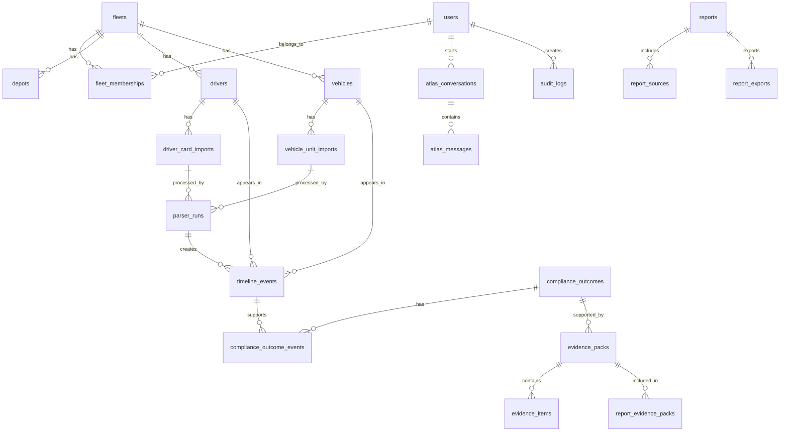

# 21 — Data Model Specification

**Document status:** Draft
**Parent system:** HourWise Fleet Portal
**Related documents:**

* `18_Compliance_Intelligence_Platform/18.2_System_Architecture.md`
* `18_Compliance_Intelligence_Platform/18.3_Import_Pipeline.md`
* `18_Compliance_Intelligence_Platform/18.4_Driver_Card_Engine.md`
* `18_Compliance_Intelligence_Platform/18.5_Vehicle_Unit_Engine.md`
* `18_Compliance_Intelligence_Platform/18.6_Timeline_Engine.md`
* `18_Compliance_Intelligence_Platform/18.7_Compliance_Engine.md`
* `18_Compliance_Intelligence_Platform/18.8_Evidence_Engine.md`
* `18_Compliance_Intelligence_Platform/18.9_Evidence_Reporting_Engine.md`
* `19_Atlas_Specification.md`
* `20_Reporting_Platform_Specification.md`
* `22_Security_Model_Specification.md`
* `23_Integration_Architecture.md`
* `24_Architecture_Decision_Records.md`

---

## 1. Purpose

This document defines the data model for the HourWise Fleet Portal and Compliance Intelligence Platform.

The data model must support:

* multi-fleet tenancy
* user accounts and role permissions
* driver records
* vehicle records
* driver card imports
* vehicle unit imports
* parser output
* normalised timeline events
* compliance calculations
* evidence packs
* report generation
* Atlas conversations
* audit logging
* future integrations
* secure data access
* evidence snapshotting

The data model is one of the most important parts of HourWise because the platform depends on trusted, traceable records.

Atlas, reports, dashboards, alerts, and compliance summaries are only valuable if the underlying data is structured, auditable, and permission-safe.

---

## 2. Core Data Principle

The core principle is:

> Store raw evidence immutably, store derived records separately, and preserve the relationship between every conclusion and its source data.

HourWise must always be able to answer:

* What source file created this record?
* Which parser version processed it?
* Which timeline events were created?
* Which compliance outcome was calculated?
* Which evidence pack supports it?
* Which report included it?
* Who reviewed it?
* What was known at export time?
* What changed later?
* Who accessed or changed the record?

---

## Implemented Capabilities

The Data Model supports all platform capabilities, specifically:

* **SYS-001**: Security Model
* **SYS-002**: Row Level Security
* **CORE-005**: Audit Trail
* **CMP-004**: Compliance Evidence
* **INT-001**: Atlas Rule Engine

---

## 4. Non-Goals

The data model must not:

* overwrite raw tachograph data
* treat AI-generated text as source truth
* allow compliance outcomes to be edited as plain text
* rely on frontend-only state
* mix multiple tenants in unsafe records
* hide evidence gaps
* delete audit history casually
* store provider API keys in ordinary tables
* expose driver data without permission checks
* assume one fleet has only one depot
* assume one driver only ever uses one vehicle
* assume one vehicle only ever has one driver
* assume current rules will never change

---

## 5. Database Assumption

The initial platform is expected to use **Supabase/Postgres**.

The model should therefore be compatible with:

* PostgreSQL relational tables
* UUID primary keys
* JSONB fields for structured flexible data
* Row Level Security policies
* Supabase Auth users
* storage buckets
* database functions where required
* indexes for query performance
* migrations

This specification is written at a platform level rather than as final SQL migrations. Exact SQL should be generated during implementation.

---

## 6. Naming Conventions

### 6.1 Table Names

Use plural snake_case names.

Examples:

```text id="dmojnw"
fleets
fleet_memberships
drivers
vehicles
driver_card_imports
vehicle_unit_imports
timeline_events
compliance_outcomes
evidence_packs
reports
atlas_conversations
audit_logs
```

### 6.2 Primary Keys

Use UUID primary keys named `id`.

Example:

```text id="6f3v71"
id uuid primary key
```

### 6.3 Foreign Keys

Use `{entity}_id`.

Examples:

```text id="681d4s"
fleet_id
driver_id
vehicle_id
report_id
evidence_pack_id
```

### 6.4 Timestamps

Use:

```text id="achao9"
created_at
updated_at
deleted_at
processed_at
exported_at
reviewed_at
```

### 6.5 Status Fields

Status fields should use controlled values.

Examples:

```text id="5ab66o"
status
readiness_state
processing_state
confidence_state
review_state
export_status
```

Avoid free-text status values.

---

## 7. Global Fields

Most business tables should include:

```text id="o5rsec"
id
fleet_id
created_at
updated_at
```

Where applicable, also include:

```text id="7lzqlb"
created_by
updated_by
deleted_at
deleted_by
source_id
version
status
metadata_json
```

### 7.1 Soft Deletion

Operational records may use soft deletion.

Evidence, imports, parser outputs, compliance outcomes, reports, exports, and audit logs should not be hard-deleted during normal use.

### 7.2 Metadata JSON

`metadata_json` may be used for non-critical flexible attributes.

It must not become a dumping ground for important relational data.

If a value is queried regularly, permission-sensitive, or part of compliance logic, it should normally be a real column or related table.

---

## 8. High-Level Entity Map



This diagram is intentionally high-level. Detailed ERDs should be expanded during the Phase 2 documentation review.

---

## 9. Tenancy Model

HourWise is a multi-tenant platform.

The core tenant entity is:

```text id="yg9gzz"
fleet
```

Most operational records must belong to a fleet.

### 9.1 Tenant Boundary

Records should include `fleet_id` wherever practical.

Examples:

* drivers
* vehicles
* imports
* parser runs
* timeline events
* compliance outcomes
* evidence packs
* reports
* Atlas conversations
* audit logs

### 9.2 Cross-Tenant Rule

A user must never be able to access another fleet’s data unless explicitly authorised through a membership or support access mechanism.

### 9.3 Support Access

Internal support access should not bypass tenancy silently.

Support access must be:

* explicit
* permissioned
* logged
* time-bound where possible
* visible in audit logs

---

## 10. Identity and Access Tables

### 10.1 `users`

Supabase Auth will provide the authentication user.

A local `users` or `profiles` table should store application profile data.

Suggested table:

```text id="ovdvbk"
profiles
```

Suggested fields:

```text id="xtwpgn"
id
auth_user_id
email
display_name
phone
avatar_url
default_fleet_id
status
created_at
updated_at
```

Notes:

* `auth_user_id` should map to Supabase Auth user ID.
* Do not store passwords.
* Do not store authentication secrets.

### 10.2 `fleets`

Represents an operator, company, or fleet account.

Suggested fields:

```text id="w1uaky"
id
name
legal_name
operator_licence_number
company_number
vat_number
country
timezone
billing_status
status
created_at
updated_at
metadata_json
```

### 10.3 `depots`

Represents a depot, operating centre, or location within a fleet.

Suggested fields:

```text id="c3j1as"
id
fleet_id
name
address_line_1
address_line_2
town_city
county_region
postcode
country
timezone
status
created_at
updated_at
```

### 10.4 `fleet_memberships`

Links users to fleets.

Suggested fields:

```text id="yil7yi"
id
fleet_id
user_id
role
status
invited_by
invited_at
joined_at
created_at
updated_at
```

Possible roles:

```text id="jctv1r"
fleet_owner
transport_manager
compliance_admin
driver
mechanic
viewer
support
```

The final role model should be defined in `22_Security_Model_Specification.md`.

### 10.5 `role_permissions`

Stores permission definitions if the system uses database-driven permissions.

Suggested fields:

```text id="d2y7w4"
id
role
permission_key
allowed
created_at
updated_at
```

Example permission keys:

```text id="91zwlc"
reports.view
reports.export
evidence.view
evidence.review
imports.create
imports.reprocess
atlas.use
atlas.fleet_summary
drivers.view
vehicles.view
```

---

## 11. Driver Tables

### 11.1 `drivers`

Represents a driver within a fleet.

Suggested fields:

```text id="bqgb5e"
id
fleet_id
depot_id
user_id
employee_number
first_name
last_name
display_name
email
phone
driver_card_number
driver_card_expiry
licence_number
licence_expiry
employment_status
active
created_at
updated_at
metadata_json
```

Notes:

* `user_id` is optional. Some drivers may not have portal logins.
* Driver card numbers may be sensitive and should be access-controlled.
* Driver records should support future licence expiry alerts.

### 11.2 `driver_cards`

Optional table for tracking multiple card records over time.

Suggested fields:

```text id="x1poby"
id
fleet_id
driver_id
card_number
issuing_country
valid_from
valid_to
status
created_at
updated_at
```

Use this if drivers may have renewed cards and historical card tracking is needed.

### 11.3 `driver_documents`

Future table for driver-related documents.

Suggested fields:

```text id="hzaur4"
id
fleet_id
driver_id
document_type
title
file_path
expiry_date
status
uploaded_by
created_at
updated_at
```

Possible uses:

* licence scans
* CPC records
* training certificates
* right-to-work documents
* medical records, if legally appropriate and securely handled

Sensitive document storage must be treated carefully.

---

## 12. Vehicle Tables

### 12.1 `vehicles`

Represents a vehicle within a fleet.

Suggested fields:

```text id="fns1jr"
id
fleet_id
depot_id
registration_number
vin
make
model
year
vehicle_type
tachograph_type
vu_serial_number
operator_vehicle_id
status
active
created_at
updated_at
metadata_json
```

### 12.2 `vehicle_units`

Optional table for tachograph vehicle unit history.

Suggested fields:

```text id="36c2wz"
id
fleet_id
vehicle_id
vu_serial_number
manufacturer
model
installed_at
calibrated_at
calibration_due_at
status
created_at
updated_at
```

### 12.3 `vehicle_documents`

Future table for vehicle documents.

Suggested fields:

```text id="rsr6hu"
id
fleet_id
vehicle_id
document_type
title
file_path
expiry_date
status
uploaded_by
created_at
updated_at
```

Possible uses:

* PMI records
* insurance
* calibration certificate
* MOT certificate
* maintenance records
* defect history exports

---

## 13. Import Data Model

The import model must preserve raw files separately from derived results.

### 13.1 Import Principle

Raw imported files are evidence.

They should be immutable.

If a file is reprocessed, create a new parser run. Do not overwrite the original file.

### 13.2 `import_batches`

Groups one or more uploaded files.

Suggested fields:

```text id="w3l3wx"
id
fleet_id
uploaded_by
batch_type
source
status
created_at
updated_at
metadata_json
```

Possible `batch_type` values:

```text id="99hqzo"
driver_card
vehicle_unit
mixed
manual
api
```

Possible `source` values:

```text id="86j4dc"
portal_upload
windows_helper
api
support_upload
future_integration
```

### 13.3 `import_files`

Stores file-level metadata for uploaded files.

Suggested fields:

```text id="7egsi9"
id
fleet_id
import_batch_id
uploaded_by
file_type
original_filename
storage_path
file_hash
file_size_bytes
mime_type
detected_format
status
duplicate_of_import_file_id
created_at
updated_at
metadata_json
```

Possible `file_type` values:

```text id="j49elr"
driver_card
vehicle_unit
unknown
unsupported
```

Possible `status` values:

```text id="flzyai"
uploaded
duplicate
queued
processing
processed
failed
unsupported
rejected
```

### 13.4 `driver_card_imports`

Represents a driver card import derived from an imported file.

Suggested fields:

```text id="otlucr"
id
fleet_id
import_file_id
driver_id
driver_card_id
card_number
issuing_country
period_start
period_end
status
created_at
updated_at
metadata_json
```

### 13.5 `vehicle_unit_imports`

Represents a vehicle unit import derived from an imported file.

Suggested fields:

```text id="0a7u3i"
id
fleet_id
import_file_id
vehicle_id
vehicle_unit_id
vu_serial_number
registration_number
period_start
period_end
status
created_at
updated_at
metadata_json
```

---

## 14. Parser Data Model

### 14.1 `parser_runs`

Represents each parser execution.

Suggested fields:

```text id="xdewc3"
id
fleet_id
import_file_id
parser_name
parser_version
parser_config_json
status
started_at
completed_at
duration_ms
error_summary
created_at
updated_at
```

Possible statuses:

```text id="q2x34x"
queued
running
completed
completed_with_warnings
failed
unsupported
```

### 14.2 `parser_outputs`

Stores structured parser output.

Suggested fields:

```text id="1hphs6"
id
fleet_id
parser_run_id
import_file_id
output_type
output_json
schema_version
created_at
updated_at
```

Possible output types:

```text id="a3ft2h"
driver_card_summary
vehicle_unit_summary
activity_records
events
faults
overspeed
technical_data
raw_decoded
```

### 14.3 `parser_errors`

Stores parser errors and warnings.

Suggested fields:

```text id="ij53gy"
id
fleet_id
parser_run_id
import_file_id
severity
error_code
message
details_json
created_at
```

Possible severity values:

```text id="zqac3m"
info
warning
error
critical
```

---

## 15. Normalised Activity Model

The parser may produce data in different shapes. The normalised activity model creates a consistent platform representation.

### 15.1 `normalised_activities`

Stores activity records derived from tachograph data.

Suggested fields:

```text id="wm7nkt"
id
fleet_id
driver_id
vehicle_id
source_type
source_id
activity_type
started_at
ended_at
duration_seconds
timezone
confidence_state
created_at
updated_at
metadata_json
```

Possible `activity_type` values:

```text id="84fh4x"
driving
work
availability
rest
break
unknown
manual_entry
ferry_train
out_of_scope
```

Possible `source_type` values:

```text id="kyo63g"
driver_card_import
vehicle_unit_import
manual_entry
future_telematics
```

### 15.2 `activity_sources`

Links normalised activities back to one or more source records.

Suggested fields:

```text id="rmok9i"
id
fleet_id
normalised_activity_id
source_type
source_id
source_reference_json
created_at
```

This allows a normalised activity to be supported by driver card data, VU data, or later integrations.

---

## 16. Timeline Data Model

### 16.1 Timeline Principle

Timeline events are derived records.

They should be traceable to source activities and parser outputs.

They should not overwrite raw data.

### 16.2 `timeline_events`

Stores reconstructed events.

Suggested fields:

```text id="qzbgkp"
id
fleet_id
driver_id
vehicle_id
event_type
started_at
ended_at
duration_seconds
timezone
confidence_state
source_summary
status
created_at
updated_at
metadata_json
```

Possible `event_type` values:

```text id="tv09mn"
driving
other_work
availability
rest
break
unknown
manual_entry
gap
daily_duty
daily_rest
weekly_rest
vehicle_movement
movement_without_card
unknown_driver
overspeed
```

Possible confidence states:

```text id="kx0fjp"
confirmed
likely
possible
uncertain
insufficient_data
```

### 16.3 `timeline_event_sources`

Links timeline events to source records.

Suggested fields:

```text id="mbfjje"
id
fleet_id
timeline_event_id
source_type
source_id
normalised_activity_id
parser_output_id
import_file_id
created_at
```

### 16.4 `timeline_gaps`

Tracks unresolved gaps.

Suggested fields:

```text id="3snytd"
id
fleet_id
driver_id
vehicle_id
started_at
ended_at
duration_seconds
gap_type
severity
reason
status
created_at
updated_at
metadata_json
```

Possible gap types:

```text id="m57h9n"
missing_driver_card_data
missing_vehicle_unit_data
unmatched_activity
unknown_driver
parser_gap
manual_review_required
```

### 16.5 `daily_timeline_summaries`

Stores daily rollups for performance.

Suggested fields:

```text id="kj81sb"
id
fleet_id
driver_id
vehicle_id
summary_date
driving_seconds
work_seconds
availability_seconds
rest_seconds
break_seconds
unknown_seconds
duty_start
duty_end
confidence_state
created_at
updated_at
metadata_json
```

These summaries can improve dashboard and report performance.

---

## 17. Compliance Data Model

### 17.1 Compliance Principle

Compliance outcomes are calculated records.

They should not be manually rewritten.

Human review should be stored separately as review notes or outcome review status.

### 17.2 `rule_sets`

Defines rule sets.

Suggested fields:

```text id="jzw30m"
id
rule_set_key
name
jurisdiction
description
active
created_at
updated_at
```

Examples:

```text id="xyw1gp"
eu_drivers_hours
uk_working_time
aetr
future_passenger_transport
```

### 17.3 `rule_versions`

Tracks specific versions of rule logic.

Suggested fields:

```text id="mjhcju"
id
rule_set_id
version
effective_from
effective_to
description
logic_reference
active
created_at
updated_at
```

### 17.4 `compliance_checks`

Represents a check run.

Suggested fields:

```text id="18a58a"
id
fleet_id
driver_id
vehicle_id
rule_set_id
rule_version_id
date_range_start
date_range_end
status
started_at
completed_at
created_at
updated_at
metadata_json
```

Possible statuses:

```text id="cboizr"
queued
running
completed
completed_with_warnings
failed
```

### 17.5 `compliance_outcomes`

Stores calculated outcomes.

Suggested fields:

```text id="47sdbi"
id
fleet_id
compliance_check_id
driver_id
vehicle_id
rule_set_id
rule_version_id
outcome_type
severity
status
confidence_state
period_start
period_end
calculated_value_json
threshold_json
message
created_at
updated_at
metadata_json
```

Possible statuses:

```text id="apxzg0"
confirmed
possible
needs_review
insufficient_data
resolved
superseded
dismissed_with_review
```

Possible severity values:

```text id="787t2p"
info
low
medium
high
critical
```

Outcome examples:

```text id="r7m693"
daily_driving_limit
weekly_driving_limit
fortnightly_driving_limit
insufficient_daily_rest
insufficient_weekly_rest
break_requirement
working_time_break
night_work
unknown_driver_activity
movement_without_card
missing_data
```

### 17.6 `compliance_outcome_events`

Links outcomes to timeline events.

Suggested fields:

```text id="wu1z3s"
id
fleet_id
compliance_outcome_id
timeline_event_id
relationship_type
created_at
```

Possible relationship types:

```text id="x920w0"
supports
contributes_to
conflicts_with
context
```

### 17.7 `compliance_outcome_sources`

Links outcomes to source records.

Suggested fields:

```text id="k43z09"
id
fleet_id
compliance_outcome_id
source_type
source_id
created_at
```

### 17.8 `review_notes`

Stores human review notes.

Suggested fields:

```text id="o2fn63"
id
fleet_id
target_type
target_id
author_user_id
note_text
review_state
atlas_assisted
atlas_message_id
created_at
updated_at
deleted_at
```

Possible target types:

```text id="r4uqxc"
compliance_outcome
evidence_pack
report
import_file
timeline_event
driver
vehicle
```

Possible review states:

```text id="z08a56"
draft
submitted
approved
rejected
superseded
```

---

## 18. Evidence Data Model

### 18.1 Evidence Principle

Evidence packs are first-class records.

They exist to connect calculated outcomes to supporting source material.

### 18.2 `evidence_packs`

Stores evidence pack records.

Suggested fields:

```text id="j2mrib"
id
fleet_id
compliance_outcome_id
driver_id
vehicle_id
title
description
status
completeness_state
confidence_state
created_by
reviewed_by
reviewed_at
created_at
updated_at
metadata_json
```

Possible statuses:

```text id="kv8lam"
draft
needs_review
complete
included_in_report
archived
superseded
```

Possible completeness states:

```text id="dzln06"
complete
incomplete
missing_required_evidence
not_applicable
unknown
```

### 18.3 `evidence_items`

Stores individual evidence items.

Suggested fields:

```text id="2o0a4w"
id
fleet_id
evidence_pack_id
item_type
source_type
source_id
title
description
required
status
created_at
updated_at
metadata_json
```

Possible item types:

```text id="xae923"
driver_card_import
vehicle_unit_import
timeline_event
compliance_outcome
review_note
manual_document
report
audit_log
future_telematics_event
```

### 18.4 `evidence_completeness_checks`

Stores evidence completeness checks.

Suggested fields:

```text id="nt8cuk"
id
fleet_id
evidence_pack_id
check_key
result
severity
message
source_type
source_id
created_at
```

Possible results:

```text id="26qf0c"
passed
warning
failed
not_applicable
```

---

## 19. Reporting Data Model

The reporting model is defined in more detail in `20_Reporting_Platform_Specification.md`.

### 19.1 `reports`

Suggested fields:

```text id="c3gpa2"
id
fleet_id
depot_id
created_by
report_type
title
description
date_range_start
date_range_end
status
readiness_state
template_id
template_version
configuration_json
created_at
updated_at
```

### 19.2 `report_sections`

Suggested fields:

```text id="ihon18"
id
fleet_id
report_id
section_key
section_title
section_order
content_json
status
created_at
updated_at
```

### 19.3 `report_sources`

Suggested fields:

```text id="hmx7d5"
id
fleet_id
report_id
source_type
source_id
source_version
included_reason
created_at
```

### 19.4 `report_evidence_packs`

Suggested fields:

```text id="osyn5a"
id
fleet_id
report_id
evidence_pack_id
inclusion_status
created_at
```

### 19.5 `report_exports`

Suggested fields:

```text id="qpjjrs"
id
fleet_id
report_id
exported_by
export_format
file_path
file_hash
file_size_bytes
snapshot_json
export_status
exported_at
created_at
```

### 19.6 `report_readiness_checks`

Suggested fields:

```text id="g2ufc6"
id
fleet_id
report_id
check_key
check_result
severity
message
source_type
source_id
created_at
```

### 19.7 `report_templates`

Suggested fields:

```text id="38b8iz"
id
template_key
version
report_type
title
description
schema_json
is_active
created_at
updated_at
```

---

## 20. Atlas Data Model

The Atlas model is defined in more detail in `19_Atlas_Specification.md`.

### 20.1 `atlas_conversations`

Suggested fields:

```text id="y04c2i"
id
fleet_id
user_id
context_type
context_id
status
created_at
updated_at
```

### 20.2 `atlas_messages`

Suggested fields:

```text id="folfvx"
id
fleet_id
conversation_id
user_id
role
message
intent
response_category
confidence_state
created_at
```

### 20.3 `atlas_message_sources`

Suggested fields:

```text id="grdlfu"
id
fleet_id
message_id
source_type
source_id
source_label
source_status
created_at
```

### 20.4 `atlas_actions`

Suggested fields:

```text id="bzntro"
id
fleet_id
message_id
user_id
action_type
target_type
target_id
requires_confirmation
status
confirmed_by
confirmed_at
created_record_type
created_record_id
created_at
updated_at
```

### 20.5 `atlas_audit_logs`

Suggested fields:

```text id="wlu58t"
id
fleet_id
user_id
conversation_id
message_id
event_type
permission_result
retrieval_summary
model_provider
model_name
model_version
prompt_template_version
created_at
```

---

## 21. Audit Data Model

### 21.1 Audit Principle

Audit logs should describe significant system activity.

They must be append-only in normal use.

### 21.2 `audit_logs`

Suggested fields:

```text id="q1s0w2"
id
fleet_id
user_id
event_type
entity_type
entity_id
action
previous_state_json
new_state_json
ip_address
user_agent
created_at
metadata_json
```

### 21.3 Events to Audit

Audit events should include:

* login
* failed login where available
* MFA challenge
* fleet membership change
* role change
* import uploaded
* import processed
* import failed
* parser run completed
* timeline generated
* compliance check run
* compliance outcome created
* evidence pack created
* evidence item linked
* review note added
* report created
* report exported
* report downloaded
* Atlas prompt submitted
* Atlas action confirmed
* permission denied
* support access used
* file download
* configuration changed

### 21.4 Audit Retention

Audit retention should be defined in the security and compliance policies.

Audit logs should not be casually deleted.

---

## 22. Notification and Task Data Model

Future proactive Atlas and compliance workflows may need task and notification tables.

### 22.1 `tasks`

Suggested fields:

```text id="6xizfw"
id
fleet_id
assigned_to
created_by
task_type
title
description
status
priority
due_at
target_type
target_id
created_at
updated_at
completed_at
```

Possible task types:

```text id="zo4ev0"
review_evidence_pack
resolve_failed_import
import_driver_card
import_vehicle_unit
review_report
add_review_note
check_driver_record
check_vehicle_record
```

### 22.2 `notifications`

Suggested fields:

```text id="6eeg05"
id
fleet_id
user_id
notification_type
title
message
status
target_type
target_id
created_at
read_at
metadata_json
```

### 22.3 `notification_preferences`

Suggested fields:

```text id="bcmi27"
id
fleet_id
user_id
channel
notification_type
enabled
frequency
created_at
updated_at
```

Possible channels:

```text id="snoq23"
portal
email
future_mobile_push
```

---

## 23. Integration Data Model

External integrations are future-phase functionality but should be anticipated.

### 23.1 `integrations`

Suggested fields:

```text id="0rkg7u"
id
fleet_id
integration_type
provider_name
status
configuration_json
created_by
created_at
updated_at
```

### 23.2 `integration_connections`

Suggested fields:

```text id="xsv1d6"
id
fleet_id
integration_id
connection_status
last_sync_at
last_error
created_at
updated_at
```

### 23.3 `integration_events`

Suggested fields:

```text id="cn80fx"
id
fleet_id
integration_id
event_type
external_reference
payload_json
processed_status
created_at
processed_at
```

### 23.4 Sensitive Integration Data

Secrets, API keys, refresh tokens, and credentials should not be stored as ordinary readable JSON in application tables.

Secure secret storage must be defined in `22_Security_Model_Specification.md`.

---

## 24. Billing and Feature Access Data Model

Billing may be handled externally, but feature access should be represented internally.

### 24.1 `subscriptions`

Suggested fields:

```text id="z4x4a7"
id
fleet_id
provider
provider_customer_id
provider_subscription_id
plan_key
status
current_period_start
current_period_end
created_at
updated_at
metadata_json
```

### 24.2 `feature_flags`

Suggested fields:

```text id="0w1wdj"
id
feature_key
description
enabled_default
created_at
updated_at
```

### 24.3 `fleet_feature_access`

Suggested fields:

```text id="w9xc6d"
id
fleet_id
feature_key
enabled
source
expires_at
created_at
updated_at
```

Possible features:

```text id="ej56bp"
atlas
advanced_reports
evidence_packs
scheduled_reports
driver_app_link
telematics_integrations
multi_depot
api_access
```

---

## 25. File Storage Model

Files should be stored in secure object storage, with database records holding metadata.

### 25.1 File Categories

File categories include:

* raw driver card files
* raw vehicle unit files
* generated reports
* manual evidence documents
* fleet logos
* driver documents
* vehicle documents
* support attachments

### 25.2 Storage Metadata

Every stored file should have a database record containing:

```text id="d5xr7p"
id
fleet_id
owner_type
owner_id
storage_bucket
storage_path
original_filename
mime_type
file_size_bytes
file_hash
uploaded_by
created_at
metadata_json
```

This may be implemented through a generic `file_assets` table.

### 25.3 `file_assets`

Suggested fields:

```text id="ukk0ul"
id
fleet_id
owner_type
owner_id
storage_bucket
storage_path
original_filename
mime_type
file_size_bytes
file_hash
uploaded_by
created_at
deleted_at
metadata_json
```

### 25.4 File Immutability

Raw tachograph files should be immutable.

If a user uploads a corrected file, it should create a new file asset and import record.

---

## 26. Status and Enum Reference

The platform should use controlled values.

### 26.1 Processing Status

```text id="qu3dvb"
queued
processing
processed
completed_with_warnings
failed
unsupported
cancelled
```

### 26.2 Confidence State

```text id="jj2j95"
confirmed
likely
possible
uncertain
insufficient_data
permission_restricted
not_supported
```

### 26.3 Review State

```text id="h6cr6m"
not_reviewed
needs_review
in_review
reviewed
approved
rejected
superseded
```

### 26.4 Evidence Completeness

```text id="6sgw7p"
complete
incomplete
missing_required_evidence
not_applicable
unknown
```

### 26.5 Report Status

```text id="q3s9zm"
draft
in_review
ready_to_export
exported
archived
blocked
superseded
cancelled
failed_export
```

### 26.6 Severity

```text id="o2yg1d"
info
low
medium
high
critical
```

---

## 27. Row Level Security Expectations

Detailed policies will be defined in `22_Security_Model_Specification.md`.

At a minimum:

* users can only access records for fleets they belong to
* drivers can only access their own permitted records
* fleet owners can manage their fleet
* transport managers can access assigned fleet/depot records
* support access must be special-cased and audited
* exports require stricter permission than viewing reports
* Atlas must use server-side permission checks before retrieval

### 27.1 RLS Principle

RLS should be applied to all tenant-owned tables.

Application logic should not be the only security boundary.

### 27.2 Service Role Caution

Backend service-role access must be used carefully.

Any service-role function must enforce explicit fleet/user permission checks before returning data.

---

## 28. Indexing Strategy

Indexes should support common access patterns.

### 28.1 Common Indexes

Recommended indexes:

```text id="1mdb06"
fleet_id
fleet_id + created_at
fleet_id + driver_id
fleet_id + vehicle_id
fleet_id + status
fleet_id + date_range_start/date_range_end
fleet_id + report_type
fleet_id + evidence_pack_id
fleet_id + compliance_outcome_id
```

### 28.2 Import Indexes

Recommended:

```text id="k23cd1"
import_files.file_hash
import_files.fleet_id + file_hash
driver_card_imports.driver_id + period_start + period_end
vehicle_unit_imports.vehicle_id + period_start + period_end
parser_runs.import_file_id
```

### 28.3 Timeline Indexes

Recommended:

```text id="moa3ej"
timeline_events.fleet_id + driver_id + started_at
timeline_events.fleet_id + vehicle_id + started_at
timeline_events.fleet_id + event_type + started_at
timeline_gaps.fleet_id + status
```

### 28.4 Compliance Indexes

Recommended:

```text id="hpzqd5"
compliance_outcomes.fleet_id + driver_id + period_start
compliance_outcomes.fleet_id + vehicle_id + period_start
compliance_outcomes.fleet_id + status
compliance_outcomes.fleet_id + severity
```

### 28.5 Reporting Indexes

Recommended:

```text id="r21vut"
reports.fleet_id + report_type + created_at
reports.fleet_id + readiness_state
report_exports.report_id
report_sources.report_id
```

### 28.6 Atlas Indexes

Recommended:

```text id="py0unm"
atlas_conversations.fleet_id + user_id + created_at
atlas_messages.conversation_id + created_at
atlas_message_sources.message_id
atlas_actions.fleet_id + status
```

---

## 29. Data Lifecycle

### 29.1 Raw Files

Raw tachograph files should be retained according to fleet policy and legal requirements.

They should not be overwritten.

### 29.2 Parser Outputs

Parser outputs should be retained with parser version metadata.

If reprocessed, create new parser outputs linked to the new parser run.

### 29.3 Timeline Events

Timeline events may be regenerated when source data changes.

Older timeline versions should be traceable where they were used in exported reports.

### 29.4 Compliance Outcomes

Compliance outcomes may be superseded by recalculation.

Do not overwrite exported-report evidence.

### 29.5 Evidence Packs

Evidence packs may be updated while in draft or review.

If included in an exported report, the export snapshot preserves the previous state.

### 29.6 Reports

Reports should retain export snapshots.

Archived or superseded reports should remain accessible to authorised users.

### 29.7 Atlas Conversations

Atlas retention should balance usefulness, audit needs, cost, and privacy.

Atlas logs linked to compliance decisions may need longer retention than casual help conversations.

---

## 30. Versioning Strategy

Versioning is required where later changes may affect interpretation.

Versioned areas:

* parser versions
* rule versions
* report template versions
* exported report snapshots
* Atlas prompt template versions
* evidence pack state at export
* compliance outcome recalculations

### 30.1 Superseding Records

Where a calculated record is replaced, use:

```text id="on47t1"
superseded_by_id
superseded_at
superseded_reason
```

where appropriate.

This should be added to tables that need recalculation history.

---

## 31. Data Quality Rules

The system should validate important data.

Examples:

* date ranges must be valid
* end time must be after start time
* duration should match start/end where possible
* file hash must be present for imported files
* driver card imports should identify a driver or remain unresolved
* VU imports should identify a vehicle or remain unresolved
* report exports must have snapshot data
* evidence items must link to valid source records
* Atlas source records must be permitted and traceable

---

## 32. Example Data Flow

### 32.1 Driver Card Import to Report

```text id="y9j32u"
import_files
  ↓
driver_card_imports
  ↓
parser_runs
  ↓
parser_outputs
  ↓
normalised_activities
  ↓
timeline_events
  ↓
compliance_checks
  ↓
compliance_outcomes
  ↓
evidence_packs
  ↓
reports
  ↓
report_exports
```

### 32.2 Atlas Explanation Flow

```text id="04c7xw"
atlas_conversations
  ↓
atlas_messages
  ↓
permission check
  ↓
retrieved source records
  ↓
atlas_message_sources
  ↓
atlas response
  ↓
audit_logs
```

---

## 33. Migration Guidelines

Database migrations should be:

* version-controlled
* reversible where practical
* tested against sample data
* documented
* deployed carefully
* compatible with RLS
* compatible with existing records

### 33.1 Migration Rules

Do:

* add tables with clear ownership
* add indexes for common queries
* add constraints where safe
* backfill carefully
* preserve existing evidence
* test RLS after migration

Do not:

* drop evidence tables casually
* rename columns without migration plan
* change enum values without data migration
* overwrite raw data
* delete audit history
* break report snapshots

---

## 34. Development and Test Data

The system should include safe development data.

### 34.1 Test Fixtures

Useful fixture types:

* valid driver card file
* valid VU file
* duplicate import
* unsupported file
* parser warning
* parser failure
* timeline gap
* daily driving issue
* weekly driving issue
* missing VU evidence
* incomplete evidence pack
* blocked report
* permission-denied Atlas query

### 34.2 Synthetic Data

Synthetic data should be clearly marked.

Synthetic records should not be mixed with customer production data.

---

## 35. Privacy Considerations

The data model may contain sensitive personal and operational data.

Sensitive data includes:

* driver identity
* driver card number
* licence information
* location and movement data
* work patterns
* compliance outcomes
* review notes
* reports
* vehicle movement history
* support access logs

The system should follow data minimisation principles.

Store what is needed for compliance and operation, not unnecessary personal detail.

---

## 36. Open Questions

The following decisions may need confirmation during implementation:

* Should driver card history be stored in a separate `driver_cards` table from the start?
* Should vehicle unit history be stored in a separate `vehicle_units` table from the start?
* How much parser output should be relational versus JSONB?
* Should timeline events be versioned directly or regenerated with snapshot preservation?
* What retention policy should apply to Atlas conversations?
* What retention policy should apply to raw tachograph files?
* Which report exports require long-term immutable storage?
* Should support access use a separate support session table?
* Should subscription and billing be in the core schema or isolated?
* Should rule definitions be stored as data or code references?

These should be resolved in future ADRs where they affect architecture.

---

## 37. MVP Data Model

The MVP should implement enough data structure to support the core compliance flow.

### 37.1 Required MVP Tables

MVP should include:

```text id="mh4lal"
profiles
fleets
fleet_memberships
depots
drivers
vehicles
import_batches
import_files
driver_card_imports
vehicle_unit_imports
parser_runs
parser_outputs
parser_errors
normalised_activities
timeline_events
timeline_event_sources
timeline_gaps
compliance_checks
compliance_outcomes
compliance_outcome_events
compliance_outcome_sources
review_notes
evidence_packs
evidence_items
evidence_completeness_checks
reports
report_sections
report_sources
report_evidence_packs
report_exports
report_readiness_checks
report_templates
atlas_conversations
atlas_messages
atlas_message_sources
atlas_actions
audit_logs
file_assets
```

### 37.2 MVP Can Defer

The MVP can defer:

```text id="y9r5un"
driver_documents
vehicle_documents
driver_cards
vehicle_units
tasks
notifications
notification_preferences
integrations
integration_connections
integration_events
subscriptions
feature_flags
fleet_feature_access
```

Some deferred tables may still be added early if implementation becomes easier with them.

---

## 38. Implementation Checklist

### 38.1 Core Tenancy

* [ ] Create profiles table
* [ ] Create fleets table
* [ ] Create fleet memberships table
* [ ] Create depots table
* [ ] Add tenant indexes
* [ ] Add RLS policies

### 38.2 Fleet Records

* [ ] Create drivers table
* [ ] Create vehicles table
* [ ] Add driver search indexes
* [ ] Add vehicle registration indexes
* [ ] Add depot relationships

### 38.3 Import Model

* [ ] Create import batches table
* [ ] Create import files table
* [ ] Create file assets table
* [ ] Create driver card imports table
* [ ] Create vehicle unit imports table
* [ ] Add file hash duplicate detection
* [ ] Add import status values

### 38.4 Parser Model

* [ ] Create parser runs table
* [ ] Create parser outputs table
* [ ] Create parser errors table
* [ ] Store parser version
* [ ] Store parser run status

### 38.5 Timeline Model

* [ ] Create normalised activities table
* [ ] Create activity sources table
* [ ] Create timeline events table
* [ ] Create timeline event sources table
* [ ] Create timeline gaps table
* [ ] Create daily timeline summaries table if needed

### 38.6 Compliance Model

* [ ] Create rule sets table
* [ ] Create rule versions table
* [ ] Create compliance checks table
* [ ] Create compliance outcomes table
* [ ] Create compliance outcome events table
* [ ] Create compliance outcome sources table
* [ ] Create review notes table

### 38.7 Evidence Model

* [ ] Create evidence packs table
* [ ] Create evidence items table
* [ ] Create evidence completeness checks table
* [ ] Add evidence status values
* [ ] Add evidence completeness values

### 38.8 Reporting Model

* [ ] Create reports table
* [ ] Create report sections table
* [ ] Create report sources table
* [ ] Create report evidence packs table
* [ ] Create report exports table
* [ ] Create report readiness checks table
* [ ] Create report templates table

### 38.9 Atlas Model

* [ ] Create atlas conversations table
* [ ] Create atlas messages table
* [ ] Create atlas message sources table
* [ ] Create atlas actions table
* [ ] Create atlas audit logs or integrate with audit logs
* [ ] Add indexes for context retrieval

### 38.10 Audit and Security

* [ ] Create audit logs table
* [ ] Add audit helper functions where useful
* [ ] Add RLS policies
* [ ] Add permission tests
* [ ] Add tenant isolation tests
* [ ] Add export access tests
* [ ] Add Atlas retrieval permission tests

---

## 39. Acceptance Criteria

The data model is acceptable when:

* every tenant-owned record is linked to a fleet
* users access records only through permitted fleet membership
* raw tachograph files are immutable
* parser runs are versioned
* parser output is traceable to imports
* normalised activities are traceable to parser output
* timeline events are traceable to source records
* compliance outcomes are traceable to timeline events and rule versions
* evidence packs link outcomes to supporting records
* reports can snapshot evidence state
* report exports remain stable after live data changes
* Atlas responses can store source links
* audit logs record important actions
* indexes support expected queries
* RLS policies protect tenant data
* future integrations can be added without replacing the core model

---

## 40. Summary

The HourWise data model must support much more than basic storage.

It must create a trustworthy chain from raw tachograph file to final report.

The expected chain is:

```text id="jxdfts"
Raw File
  ↓
Parser Run
  ↓
Parser Output
  ↓
Normalised Activity
  ↓
Timeline Event
  ↓
Compliance Outcome
  ↓
Evidence Pack
  ↓
Report
  ↓
Report Export Snapshot
```

Atlas, dashboards, alerts, and future integrations should sit on top of this chain.

They must not replace it.

The data model should make HourWise:

* secure
* auditable
* explainable
* scalable
* evidence-led
* ready for future expansion

The guiding rule is:

> If HourWise makes a statement, the data model must be able to show where that statement came from.
