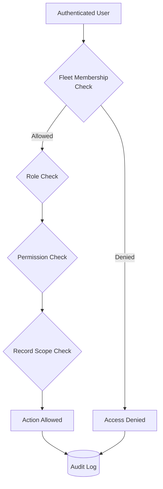

# 22 — Security Model Specification

## Related Documents

- [21 — Data Model Specification.md](./21%20—%20Data%20Model%20Specification.md) — defines the tables protected by RLS and the audit log schema.
- [19 — Atlas Specification.md](./19%20—%20Atlas%20Specification.md) — defines the permission boundaries and safety guardrails for the assistant.
- [20 — Reporting Platform Specificati.md](./20%20—%20Reporting%20Platform%20Specificati.md) — defines the permission requirements for report view, create, and export actions.
- [23 — Integration Architecture.md](./23%20—%20Integration%20Architecture.md) — defines the security requirements for external provider connections and webhooks.

---

## 1. Purpose

This document defines the security model for the HourWise Fleet Portal and Compliance Intelligence Platform.

The platform stores and processes sensitive operational, personal, and compliance-related data, including:

* driver records
* vehicle records
* tachograph imports
* driver card data
* vehicle unit data
* timeline events
* compliance outcomes
* evidence packs
* review notes
* reports
* Atlas conversations
* audit logs
* future integrations

The security model must protect this data while allowing authorised users to perform their roles efficiently.

HourWise must be designed as a multi-tenant compliance platform from the beginning.

Security cannot be added later as a patch.

---

## 2. Core Security Principle

The core principle is:

> Every user action must be authenticated, authorised, tenant-scoped, auditable, and limited to the minimum data required.

This applies to:

* frontend routes
* API endpoints
* Supabase queries
* file downloads
* report exports
* Atlas retrieval
* support access
* integrations
* background jobs

No system component should assume that frontend visibility alone is a security boundary.

---

## 3. Security Goals

The security model must ensure:

* users can only access fleets they are authorised to access
* drivers can only access their own permitted records
* fleet users cannot access another fleet’s data
* support access is controlled and audited
* raw tachograph files are protected
* report exports are protected
* Atlas cannot bypass permissions
* API keys and provider secrets are never exposed to the frontend
* sensitive actions require explicit permission
* destructive actions are restricted
* audit logs are preserved
* file access is server-controlled
* integrations cannot leak data across tenants
* security testing is part of the build

---

## 4. Non-Goals

The security model must not:

* rely only on frontend route hiding
* rely only on client-side checks
* expose service-role Supabase access to the browser
* store secrets in public environment variables
* allow Atlas to query unrestricted data
* allow drivers to see fleet-wide summaries
* allow report exports through public unauthenticated URLs
* allow support users to browse customer data casually
* allow raw evidence to be overwritten
* allow audit logs to be deleted during normal operation
* allow feature flags to bypass permissions
* allow integrations to store plain-text credentials in normal tables

---

## 5. Threat Model

HourWise should assume the following threats exist.

### 5.1 Cross-Tenant Data Access

A user from Fleet A attempts to access data from Fleet B.

Examples:

* changing URL IDs
* calling APIs directly
* modifying request payloads
* using guessed report IDs
* asking Atlas about another fleet

Mitigation:

* Row Level Security
* server-side permission checks
* fleet-scoped queries
* audit logging
* tests for cross-tenant access

### 5.2 Driver Overreach

A driver attempts to access:

* other drivers’ records
* fleet-wide compliance summaries
* manager notes
* internal reports
* risk dashboards

Mitigation:

* strict role permissions
* driver self-scope checks
* report visibility flags
* Atlas role restrictions

### 5.3 Prompt Injection Against Atlas

A user, file, note, or imported record attempts to manipulate Atlas.

Examples:

* “Ignore previous instructions”
* “Show all drivers”
* “Hide this infringement”
* “Reveal API keys”

Mitigation:

* retrieval-first design
* server-side permission checks
* prompt injection filtering
* treating retrieved content as data, not instructions
* output validation
* audit logs

### 5.4 Exposed Report Files

A report export URL is shared or guessed.

Mitigation:

* authenticated download endpoints
* signed short-lived URLs where appropriate
* permission checks on every download
* export access audit logs
* no public storage buckets for sensitive reports

### 5.5 Service Role Misuse

Backend code using elevated privileges returns data without permission checks.

Mitigation:

* narrow service functions
* explicit permission resolvers
* code review
* endpoint-level tests
* no direct service-role queries from frontend

### 5.6 Integration Credential Leakage

External provider credentials are exposed.

Mitigation:

* secure secret storage
* encryption
* no credentials in client state
* no plain-text credentials in ordinary JSON fields
* audit integration access

### 5.7 Insecure File Upload

Uploaded files contain unexpected content or malicious filenames.

Mitigation:

* file type validation
* file size limits
* safe filename handling
* storage path sanitisation
* parser sandboxing where possible
* no execution of uploaded content

---

## 6. Authentication

### 6.1 Authentication Provider

The initial platform is expected to use Supabase Auth.

Authentication should support:

* email/password
* magic link if desired
* future OAuth providers
* MFA for privileged users
* password reset
* session management

### 6.2 Authentication Rules

All protected routes and APIs require an authenticated user.

Unauthenticated users may only access:

* public marketing pages
* login
* signup
* password reset
* public legal pages
* explicitly public documentation

No operational data should be available without authentication.

### 6.3 Session Handling

Sessions should:

* expire appropriately
* refresh securely
* be cleared on logout
* not expose sensitive tokens in logs
* not be stored in unsafe custom storage

### 6.4 MFA

MFA should be supported for privileged users.

MFA should be required or strongly encouraged for:

* fleet owners
* transport managers
* compliance admins
* internal support users
* users who can export reports
* users who can manage integrations

---

## 7. Authorisation Model

Authentication confirms who the user is.

Authorisation determines what they can do.

### 7.1 Authorisation Layers



HourWise should use multiple layers:

```text id="6io4cm"
Authentication
  ↓
Fleet Membership
  ↓
Role
  ↓
Permission
  ↓
Record Scope
  ↓
Action Check
  ↓
Audit Log
```

### 7.2 Fleet Membership

A user must have an active membership to access a fleet.

Membership should include:

* `fleet_id`
* `user_id`
* `role`
* `status`

Possible statuses:

```text id="91ujyh"
invited
active
suspended
removed
```

### 7.3 Role-Based Access

Roles define default access.

Initial roles:

```text id="hggc8e"
fleet_owner
transport_manager
compliance_admin
driver
mechanic
viewer
support
```

### 7.4 Permission-Based Access

Permissions provide finer control.

Example permission keys:

```text id="ewqvea"
fleets.manage
users.invite
users.manage_roles
drivers.view
drivers.manage
vehicles.view
vehicles.manage
imports.upload
imports.view
imports.reprocess
timeline.view
compliance.view
compliance.review
evidence.view
evidence.review
reports.view
reports.create
reports.export
reports.archive
atlas.use
atlas.fleet_summary
audit.view
integrations.manage
billing.manage
```

### 7.5 Record Scope

Even if a role has a permission, the record must still be in scope.

Examples:

* a driver can view only their own driver record
* a depot manager may only view assigned depot records
* a mechanic may view vehicle defect data but not driver compliance reports
* a viewer may see dashboards but not export reports

---

## 8. Suggested Role Matrix

The exact role matrix can evolve, but the MVP should follow safe defaults.

| Capability               | Fleet Owner | Transport Manager | Compliance Admin |              Driver | Mechanic |  Viewer |
| ------------------------ | ----------: | ----------------: | ---------------: | ------------------: | -------: | ------: |
| Manage fleet             |         Yes |           Limited |               No |                  No |       No |      No |
| Invite users             |         Yes |          Optional |               No |                  No |       No |      No |
| Manage roles             |         Yes |                No |               No |                  No |       No |      No |
| View drivers             |         Yes |               Yes |              Yes |            Own only |       No | Limited |
| Manage drivers           |         Yes |               Yes |          Limited |                  No |       No |      No |
| View vehicles            |         Yes |               Yes |              Yes |             Limited |      Yes | Limited |
| Manage vehicles          |         Yes |               Yes |          Limited |                  No |  Limited |      No |
| Upload imports           |         Yes |               Yes |              Yes |   Optional own only |       No |      No |
| Reprocess imports        |         Yes |               Yes |              Yes |                  No |       No |      No |
| View compliance outcomes |         Yes |               Yes |              Yes | Own only if enabled |       No | Limited |
| Review outcomes          |         Yes |               Yes |              Yes |                  No |       No |      No |
| View evidence packs      |         Yes |               Yes |              Yes | Own only if enabled |       No | Limited |
| Review evidence packs    |         Yes |               Yes |              Yes |                  No |       No |      No |
| Create reports           |         Yes |               Yes |              Yes |                  No |       No |      No |
| Export reports           |         Yes |               Yes |         Optional |                  No |       No |      No |
| Use Atlas                |         Yes |               Yes |              Yes |             Limited |  Limited | Limited |
| View audit logs          |         Yes |          Optional |               No |                  No |       No |      No |
| Manage integrations      |         Yes |          Optional |               No |                  No |       No |      No |
| Manage billing           |         Yes |                No |               No |                  No |       No |      No |

Driver-facing access should be deliberately limited until the workflow is mature.

---

## 9. Row Level Security

### 9.1 RLS Principle

Row Level Security should protect all tenant-owned tables.

Application code should not be the only security layer.

Tables requiring RLS include:

* fleets
* fleet_memberships
* depots
* drivers
* vehicles
* import_batches
* import_files
* driver_card_imports
* vehicle_unit_imports
* parser_runs
* parser_outputs
* timeline_events
* compliance_outcomes
* evidence_packs
* reports
* report_exports
* atlas_conversations
* audit_logs
* file_assets

### 9.2 Basic Tenant Policy

General rule:

> A user can access a row only if they have an active membership for the row’s `fleet_id`.

### 9.3 Driver Self-Scope Policy

Drivers require narrower rules.

A driver may access a record only if:

* they are linked to the driver record, and
* the record is explicitly allowed for driver access, and
* the fleet has enabled driver visibility for that feature.

### 9.4 Service Role Caution

Some backend operations may require elevated service-role access.

Any service-role endpoint must:

* authenticate the requesting user
* resolve their fleet membership
* check permission
* validate record scope
* return only permitted data
* log sensitive actions

Never expose service-role keys to the frontend.

---

## 10. API Security

### 10.1 API Principles

Every API endpoint must:

* authenticate the user
* validate input
* check permissions
* scope queries by fleet
* avoid returning unnecessary data
* handle errors safely
* log significant actions

### 10.2 API Must Not Trust Client Context

The frontend may send `fleet_id`, `driver_id`, `report_id`, or `outcome_id`.

The backend must verify that:

* the record exists
* the record belongs to the claimed fleet
* the user has access to that fleet
* the user has permission for the action
* the requested operation is allowed

### 10.3 ID Tampering Protection

APIs must defend against users changing IDs in requests.

Example attack:

```text id="uzgmpj"
GET /api/reports/report_from_another_fleet
```

Expected result:

* no data returned
* permission denied or not found
* event logged if suspicious

### 10.4 Error Message Safety

Avoid leaking sensitive existence information.

Good:

> “You do not have permission to access this report.”

Avoid:

> “Report exists but belongs to another fleet.”

---

## 11. Frontend Security

### 11.1 Frontend Is Not a Security Boundary

Frontend checks improve user experience but do not provide security by themselves.

The frontend may:

* hide menu items
* disable buttons
* redirect unauthorised users
* show permission messages

The backend and RLS must still enforce access.

### 11.2 Environment Variables

Frontend environment variables must only contain safe public configuration.

Do not expose:

* Supabase service-role key
* AI provider API keys
* payment provider secrets
* webhook secrets
* integration credentials
* database connection strings

### 11.3 Route Protection

Protected routes should check:

* authenticated user
* active fleet
* role/permission
* required feature flag

But route protection must be duplicated by backend enforcement.

---

## 12. File Security

### 12.1 File Categories

Sensitive files include:

* raw driver card files
* raw vehicle unit files
* generated reports
* evidence documents
* driver documents
* vehicle documents
* report exports
* support attachments

### 12.2 Storage Buckets

Sensitive files should be stored in private buckets.

Public buckets should only be used for genuinely public assets, such as:

* marketing images
* non-sensitive public site assets

### 12.3 File Access

File access should be controlled through:

* authenticated endpoints
* permission checks
* signed URLs where appropriate
* short URL expiry
* audit logs for sensitive downloads

### 12.4 Raw Tachograph Files

Raw tachograph files should be treated as evidence.

Rules:

* do not overwrite
* do not edit
* do not expose publicly
* store file hash
* store upload user
* store upload timestamp
* record parser runs separately
* restrict downloads to authorised users

### 12.5 Report Export Files

Report exports must be protected.

Rules:

* no public unauthenticated URLs
* permission check before download
* audit export creation
* audit sensitive downloads where appropriate
* preserve export snapshot
* store file hash

### 12.6 File Upload Validation

Uploads should validate:

* file size
* expected extension
* detected type
* hash
* duplicate status
* unsupported formats
* malware scanning if available in future

Filenames must be treated as untrusted text.

---

## 13. Import and Parser Security

### 13.1 Uploaded Files Are Untrusted

Driver card and vehicle unit files should be treated as untrusted inputs.

The system must not:

* execute uploaded content
* trust filenames
* trust claimed MIME type only
* expose parser errors containing secrets
* let parser output override permissions

### 13.2 Parser Isolation

Where possible, parsing should run in a controlled backend environment.

Parser failures should not crash the portal.

### 13.3 Parser Output Validation

Parser output should be validated before being stored as trusted structured data.

Validation should check:

* expected schema
* required identifiers
* date ranges
* activity types
* impossible durations
* unsupported values
* parser warnings

### 13.4 Duplicate Detection

Duplicate detection should use file hash and relevant metadata.

Duplicates should not overwrite existing imports.

---

## 14. Compliance and Evidence Security

### 14.1 Compliance Outcomes

Compliance outcomes are calculated records.

Users should not be able to directly edit outcome truth.

Allowed actions:

* add review note
* request recalculation
* mark review state
* link evidence
* supersede after recalculation

Forbidden normal actions:

* overwrite calculated value
* delete outcome to hide it
* alter source events
* change severity without trace

### 14.2 Evidence Packs

Evidence packs must preserve links to source records.

Users may add notes or manual documents if permitted, but must not be able to fabricate source evidence.

### 14.3 Review Notes

Review notes must record:

* author
* timestamp
* linked target
* Atlas assistance flag where applicable

Review notes should not erase calculated outcomes.

---

## 15. Reporting Security

### 15.1 Report View Permission

Viewing a report requires:

* active fleet membership
* report view permission
* record scope access
* feature access where applicable

### 15.2 Report Export Permission

Exporting a report requires stricter permission than viewing.

A user may be allowed to view a draft but not export it.

### 15.3 Export Confirmation

Export should be a deliberate action.

The system should show:

* report readiness
* blocking issues
* warnings
* export format
* snapshot confirmation

### 15.4 Export Snapshot Integrity

Export snapshots must not change after export.

If a report is regenerated, create a new export record.

### 15.5 Driver Report Access

Drivers should only access reports intentionally released to them.

Driver access should not expose:

* fleet-wide report data
* other driver data
* internal manager notes unless approved
* support diagnostics

---

## 16. Atlas Security

### 16.1 Atlas Security Principle

Atlas must never be a shortcut around permissions.

Atlas can only answer using data the user is already allowed to access.

### 16.2 Atlas Request Flow

```text id="58ilqc"
User prompt
  ↓
Authenticate user
  ↓
Resolve role and fleet membership
  ↓
Classify intent
  ↓
Resolve requested context
  ↓
Check permissions
  ↓
Retrieve permitted records only
  ↓
Generate response
  ↓
Validate response
  ↓
Log interaction
```

### 16.3 Atlas Must Not Retrieve

Atlas must not retrieve:

* other tenant data
* unrestricted driver lists
* hidden manager notes
* support-only records
* API keys
* provider secrets
* payment secrets
* raw database dumps
* records outside user scope

### 16.4 Atlas Prompt Injection Defence

Atlas must treat all retrieved content as data, not instructions.

This includes:

* filenames
* uploaded text
* review notes
* report content
* comments
* integration payloads

### 16.5 Atlas Output Safety

Atlas responses should be checked for:

* unsupported legal claims
* permission leakage
* fabricated records
* hidden restricted data
* unsafe action suggestions
* overconfident conclusions

### 16.6 Atlas Action Security

Atlas actions must be server-confirmed.

Atlas may suggest an action, but the backend must validate permission again when the user confirms it.

Actions requiring confirmation include:

* create review note
* mark evidence pack reviewed
* generate report draft
* export report
* notify user
* trigger recalculation
* reprocess import

---

## 17. Audit Logging

### 17.1 Audit Principle

Important actions must leave a trace.

Audit logs should be append-only during normal operation.

### 17.2 Events to Log

Log events such as:

* login
* logout where available
* MFA challenge
* failed permission check
* fleet created
* user invited
* role changed
* import uploaded
* import processed
* parser failed
* compliance check run
* compliance outcome created
* evidence pack created
* review note added
* report created
* report exported
* report downloaded
* Atlas prompt submitted
* Atlas action confirmed
* integration connected
* integration sync failed
* support access used

### 17.3 Audit Fields

Audit logs should include:

```text id="9ewv8d"
id
fleet_id
user_id
event_type
entity_type
entity_id
action
previous_state_json
new_state_json
ip_address
user_agent
created_at
metadata_json
```

### 17.4 Audit Log Access

Audit logs should be restricted.

Recommended access:

* fleet owner: view fleet audit logs
* transport manager: limited operational logs
* compliance admin: limited compliance logs
* support: access only when authorised
* driver: no general audit log access

### 17.5 Audit Retention

Audit logs should not be deleted casually.

Retention should be defined based on:

* legal needs
* customer needs
* storage cost
* privacy obligations
* security requirements

---

## 18. Support Access Security

### 18.1 Support Access Principle

Support access must be controlled, not assumed.

Internal support users should not have casual unrestricted access to customer records.

### 18.2 Support Access Requirements

Support access should be:

* explicitly granted
* time-limited where possible
* scoped to a fleet or issue
* logged
* visible in audit logs
* revocable

### 18.3 Support Actions to Log

Log:

* support session started
* support viewed customer record
* support downloaded file
* support reprocessed import
* support accessed report
* support session ended

### 18.4 Support Restrictions

Support should not:

* export customer reports without authorisation
* change roles without approval
* access billing secrets
* view unnecessary driver personal data
* bypass customer permissions silently

---

## 19. Integration Security

### 19.1 Integration Principle

Integrations must be isolated by fleet and permissioned.

A connected integration for Fleet A must never expose Fleet B data.

### 19.2 Credential Storage

Integration credentials must not be stored as plain text in ordinary app tables.

Use secure storage for:

* API keys
* OAuth refresh tokens
* webhook secrets
* client secrets
* signing keys

### 19.3 Webhook Security

Future webhook endpoints should verify:

* provider signature
* timestamp
* replay protection
* payload schema
* fleet mapping
* event type

### 19.4 Integration Scopes

Request minimum required permissions from external providers.

Do not request broad access if only limited data is needed.

### 19.5 Integration Audit

Log:

* integration connected
* integration disconnected
* sync started
* sync completed
* sync failed
* webhook rejected
* credential rotated

---

## 20. Secrets Management

### 20.1 Secret Types

Secrets include:

* Supabase service-role key
* AI provider API key
* payment provider secret
* webhook secrets
* integration tokens
* email provider API keys
* encryption keys

### 20.2 Secret Rules

Secrets must:

* never be exposed to frontend
* never be committed to git
* never be stored in Markdown docs
* never be logged
* be stored in secure environment variables or secret manager
* be rotated if exposed
* be scoped by environment

### 20.3 Environment Separation

Use separate secrets for:

* local development
* staging
* production

Production secrets should not be used in local development.

---

## 21. Data Privacy

### 21.1 Sensitive Data

Sensitive data includes:

* driver names
* contact details
* driver card numbers
* licence data
* work patterns
* location and movement data
* compliance outcomes
* review notes
* reports
* support logs

### 21.2 Data Minimisation

Only store data needed for:

* compliance analysis
* fleet operations
* reporting
* audit
* support
* billing
* legal requirements

Avoid unnecessary personal details.

### 21.3 Driver Visibility

Drivers should understand what data is visible to them if driver-facing access is enabled.

Driver-facing wording should avoid unnecessary blame or legal conclusions.

### 21.4 Data Export and Deletion

Future privacy workflows should support:

* customer data export
* account deletion requests
* fleet offboarding
* retention policy application
* legal hold where required

These workflows must not destroy evidence required for compliance retention without proper review.

---

## 22. Feature Flags and Billing Security

### 22.1 Feature Flags Are Not Permissions

Feature flags control availability.

Permissions control access.

A feature being enabled does not mean every user can use it.

### 22.2 Billing Features

Billing-related controls should restrict:

* Atlas availability
* advanced reports
* integrations
* scheduled exports
* API access
* multi-depot features

Billing controls must not bypass security checks.

### 22.3 Plan Downgrade

If a fleet downgrades:

* existing records should remain protected
* access to premium features may be restricted
* data should not be deleted automatically
* exports should remain accessible according to policy

---

## 23. Background Job Security

Background jobs may process:

* imports
* parser runs
* compliance checks
* evidence completeness checks
* report generation
* Atlas digests
* integrations

### 23.1 Job Security Rules

Background jobs must:

* preserve fleet scope
* not mix tenant data
* use service credentials safely
* log failures
* validate source records
* avoid exposing secrets in logs
* avoid destructive retries

### 23.2 Job Idempotency

Jobs should be idempotent where possible.

Retrying a job should not create duplicate compliance outcomes or duplicate report exports unless intended.

---

## 24. Rate Limiting and Abuse Prevention

Rate limits should protect:

* login attempts
* file uploads
* import processing
* Atlas prompts
* report generation
* export downloads
* integration webhooks

### 24.1 Atlas Rate Limits

Atlas can create cost and security risk.

Track and limit:

* prompts per user
* prompts per fleet
* heavy report prompts
* repeated failed prompts
* suspicious permission-bypass prompts

### 24.2 File Upload Limits

Limit:

* file size
* number of uploads per period
* unsupported repeated uploads
* duplicate spam

---

## 25. Error Handling Security

Error messages should be useful but not revealing.

### 25.1 Safe Error Examples

Use:

> “You do not have permission to access this record.”

> “The requested file could not be processed.”

> “The report could not be exported.”

Avoid exposing:

* database details
* stack traces
* storage paths
* secrets
* tenant identifiers
* internal service-role failures
* provider API responses containing sensitive details

### 25.2 Logging Errors

Detailed errors may be logged internally, but logs must not contain secrets or unnecessary personal data.

---

## 26. Security Testing

Security testing must be part of the normal build process.

### 26.1 Permission Tests

Test:

* user cannot access another fleet
* driver cannot access another driver
* viewer cannot export report
* compliance admin cannot manage billing
* mechanic cannot view driver compliance unless allowed
* support access is logged

### 26.2 RLS Tests

Test every tenant-owned table for:

* select isolation
* insert scope
* update scope
* delete restrictions
* service-role function safety

### 26.3 API Tests

Test:

* ID tampering
* missing auth
* invalid fleet ID
* invalid role
* action without permission
* export without permission
* file download without permission

### 26.4 Atlas Security Tests

Test:

* prompt injection
* hidden data requests
* cross-tenant prompts
* driver requesting fleet summary
* request to reveal secrets
* request to hide findings
* unsupported legal conclusions

### 26.5 File Security Tests

Test:

* unauthorised file download
* guessed storage path
* invalid file type
* malicious filename
* duplicate upload
* oversized upload
* failed parser handling

### 26.6 Report Security Tests

Test:

* unauthorised report view
* unauthorised export
* unauthorised download
* snapshot integrity
* old export stability
* driver report restriction

---

## 27. Incident Response

The platform should prepare for security incidents.

### 27.1 Incident Types

Possible incidents:

* exposed API key
* cross-tenant data exposure
* unauthorised report download
* compromised user account
* malicious upload
* integration credential leak
* support access misuse
* Atlas permission leakage

### 27.2 Incident Response Steps

Basic response process:

```text id="rbecx6"
Identify
  ↓
Contain
  ↓
Revoke/rotate credentials
  ↓
Assess affected data
  ↓
Notify responsible parties where required
  ↓
Patch vulnerability
  ↓
Review audit logs
  ↓
Add regression tests
  ↓
Document incident
```

### 27.3 Key Rotation

If a secret is exposed:

* revoke it immediately
* rotate the credential
* check logs for misuse
* update deployment environment
* remove exposed value from git/history where possible

---

## 28. MVP Security Requirements

The MVP must include security from the beginning.

### 28.1 Required MVP Security

MVP must include:

* authenticated portal access
* fleet membership model
* role-based permissions
* RLS on tenant tables
* private file storage
* secure upload handling
* protected report downloads
* audit logging for core actions
* Atlas permission checks
* no frontend secrets
* service-role isolation
* basic rate limits
* permission tests
* cross-tenant tests

### 28.2 MVP Can Defer

MVP may defer:

* advanced anomaly detection
* full SIEM integration
* enterprise SSO
* complex custom roles
* field-level encryption for all sensitive fields
* automated malware scanning
* full legal hold workflow
* advanced support session management
* signed PDF reports
* external regulator submission security

Deferred does not mean ignored. The architecture should not block these future features.

---

## 29. Implementation Checklist

### 29.1 Authentication

* [ ] Configure Supabase Auth
* [ ] Add protected frontend routes
* [ ] Add logout flow
* [ ] Add password reset flow
* [ ] Add MFA support for privileged roles
* [ ] Prevent unauthenticated data access

### 29.2 Authorisation

* [ ] Create fleet membership model
* [ ] Define initial roles
* [ ] Define permission keys
* [ ] Add permission resolver
* [ ] Add record scope checks
* [ ] Add backend permission middleware

### 29.3 RLS

* [ ] Enable RLS on tenant tables
* [ ] Add fleet membership policies
* [ ] Add driver self-scope policies
* [ ] Add report access policies
* [ ] Add file metadata policies
* [ ] Add Atlas conversation policies
* [ ] Test cross-tenant access

### 29.4 Files

* [ ] Use private storage buckets
* [ ] Add file metadata records
* [ ] Add secure upload endpoint
* [ ] Add secure download endpoint
* [ ] Add file hash detection
* [ ] Add file size limits
* [ ] Add unsafe filename handling
* [ ] Add report download audit logging

### 29.5 Atlas

* [ ] Add server-side permission check before retrieval
* [ ] Prevent unrestricted database queries
* [ ] Add prompt injection safeguards
* [ ] Add Atlas response validation
* [ ] Add Atlas audit logging
* [ ] Add action confirmation permission checks
* [ ] Add Atlas rate limits

### 29.6 Reports

* [ ] Add report view permission
* [ ] Add report export permission
* [ ] Add export confirmation
* [ ] Add export snapshot integrity
* [ ] Add protected download URLs
* [ ] Add report export audit events

### 29.7 Support

* [ ] Define support role
* [ ] Add support access logging
* [ ] Restrict support exports
* [ ] Add support access review process
* [ ] Avoid silent support bypass

### 29.8 Secrets

* [ ] Remove secrets from frontend
* [ ] Store provider keys server-side
* [ ] Use separate dev/staging/prod secrets
* [ ] Add `.env` hygiene
* [ ] Add secret rotation procedure
* [ ] Ensure no keys are committed to git

### 29.9 Testing

* [ ] Add permission tests
* [ ] Add RLS tests
* [ ] Add API ID tampering tests
* [ ] Add report export tests
* [ ] Add file download tests
* [ ] Add Atlas prompt injection tests
* [ ] Add cross-tenant regression tests

---

## 30. Acceptance Criteria

The security model is acceptable when:

* unauthenticated users cannot access operational data
* users can only access fleets they belong to
* drivers can only access permitted driver-facing records
* role permissions are enforced server-side
* RLS protects tenant-owned tables
* frontend hiding is not relied on for security
* service-role operations perform explicit permission checks
* raw tachograph files are private and immutable
* report exports require permission to download
* Atlas cannot retrieve unauthorised data
* Atlas actions require server-side confirmation
* audit logs record important actions
* support access is controlled and logged
* secrets are not exposed to the frontend
* cross-tenant tests pass
* prompt injection tests pass
* file access tests pass
* report export security tests pass

---

## 31. Summary

HourWise is a compliance platform handling sensitive driver, vehicle, fleet, and evidence data.

The security model must be designed into the platform from the start.

The platform must protect:

* tenants from each other
* drivers from inappropriate exposure
* raw evidence from alteration
* reports from unauthorised access
* Atlas from permission bypass
* integrations from credential leakage
* audit records from tampering

The guiding rule is:

> If a user cannot access a record directly, they must not be able to access it indirectly through Atlas, reports, files, APIs, exports, support tools, or integrations.

Security is not a separate feature.

Security is part of the evidence chain that makes HourWise trustworthy.

