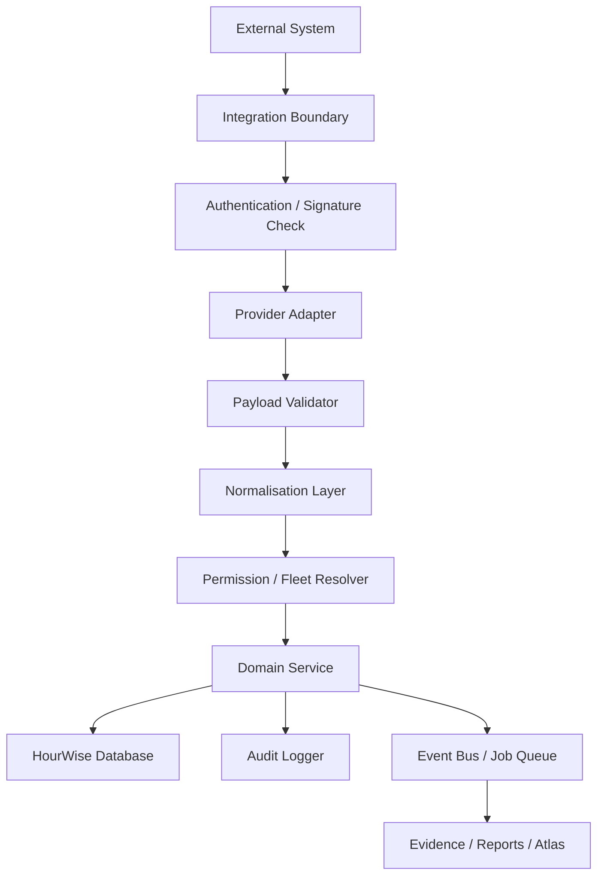

# 23 — Integration Architecture

## Related Documents

- `22_Security_Model_Specification.md` — defines the authentication and credential security requirements for integrations.
- `21_Data_Model_Specification.md` — defines the `integrations` and `integration_events` tables.
- `19_Atlas_Specification.md` — defines how Atlas uses integration data as supplementary context.
- `20_Reporting_Platform_Specification.md` — defines how integration data is snapshotted in exported reports.
- `24_Architecture_Decision_Records.md` — contains decisions regarding provider adapters and supplementary evidence (ADR-0010, ADR-0011).

---

## 1. Purpose

This document defines the integration architecture for the HourWise Fleet Portal.

The Integration Architecture explains how HourWise should connect with internal modules, external systems, partner APIs, future telematics providers, mobile apps, reporting services, email services, billing providers, and AI services.

HourWise should be designed as a connected fleet compliance platform, but integrations must not weaken the trusted compliance foundation.

Integrations should extend HourWise. They must not bypass:

* tenant isolation
* permission checks
* evidence integrity
* import validation
* audit logging
* report snapshotting
* Atlas safety controls
* security boundaries

---

## 2. Core Principle

The core integration principle is:

> External systems may provide supporting data, but HourWise must control how that data is validated, stored, linked, permissioned, and used.

An integration should never be allowed to directly mutate trusted compliance records without passing through HourWise-controlled validation and workflow layers.

---

## 3. Integration Goals

The integration architecture should allow HourWise to connect with:

* driver mobile app data
* fleet portal modules
* tachograph import helpers
* GPS and telematics providers
* vehicle tracking systems
* vehicle check systems
* maintenance systems
* payroll systems
* accounting systems
* email providers
* calendar providers
* AI providers
* billing providers
* reporting/export services
* future partner APIs

The goal is to make HourWise flexible without creating a fragile, insecure, or provider-specific architecture.

---

## 4. Non-Goals

The integration architecture must not:

* allow external systems to overwrite raw tachograph evidence
* allow integrations to bypass permissions
* allow provider data to become trusted without validation
* require one provider to be hardcoded everywhere
* expose API keys to the frontend
* mix data between fleets
* silently send reports externally
* treat GPS data as a replacement for tachograph data
* allow Atlas unrestricted access to integration payloads
* store credentials in plain text
* create one-off integration logic that cannot be maintained
* make the MVP dependent on future integrations

---

## 5. Integration Maturity Stages

Integrations should be introduced in stages.

```text id="k3o1bx"
Stage 1: Internal Module Integration
Stage 2: Controlled Import Helper Integration
Stage 3: Notification and Email Integration
Stage 4: Billing and Feature Access Integration
Stage 5: Telematics and GPS Integration
Stage 6: Partner API and Marketplace Integration
```

The MVP should focus on the first two stages only where required.

---

## 6. High-Level Integration Architecture



Every integration should pass through a controlled boundary before data becomes part of HourWise.

---

## 7. Integration Layers

### 7.1 Integration Boundary

The boundary is the entry point into HourWise.

Examples:

* API endpoint
* webhook endpoint
* upload endpoint
* helper polling endpoint
* background sync job
* mobile app sync endpoint

The boundary must handle:

* authentication
* signature checks where applicable
* rate limiting
* request validation
* logging
* rejection of invalid requests

### 7.2 Provider Adapter

The provider adapter translates provider-specific data into HourWise-compatible structures.

Examples:

* GPS provider adapter
* telematics adapter
* billing provider adapter
* email provider adapter
* tachograph helper adapter
* AI provider adapter

Provider-specific logic should live in adapters, not across the whole codebase.

### 7.3 Payload Validator

The validator checks incoming payloads before they are stored or acted upon.

It should validate:

* schema
* required fields
* date/time format
* fleet mapping
* source identity
* duplicate event IDs
* event type
* size limits
* unsupported values

### 7.4 Normalisation Layer

The normalisation layer converts external data into internal HourWise concepts.

Examples:

* GPS event → location event
* telematics ignition event → vehicle activity signal
* mobile app work session → app-recorded work session
* billing event → subscription status change
* email delivery event → notification status

### 7.5 Domain Service

Domain services decide what the data means inside HourWise.

Examples:

* import service
* timeline service
* evidence service
* reporting service
* notification service
* billing service
* Atlas retrieval service

### 7.6 Audit Logger

Every important integration action should be logged.

Examples:

* integration connected
* sync started
* sync completed
* webhook received
* webhook rejected
* payload validation failed
* credential rotated
* external report sent
* billing plan changed

---

## 8. Internal Integrations

Internal integrations connect HourWise modules to each other.

These should be preferred before external integrations.

### 8.1 Internal Modules

Internal modules may include:

* Compliance Intelligence Platform
* Reporting Platform
* Atlas
* Driver App
* Fleet Messaging
* Vehicle Checks
* Defect Reporting
* Maintenance Calendar
* Incident Reporting
* Expenses
* Payroll Summary
* Document Storage
* Licence Monitoring
* Notifications

### 8.2 Internal Integration Principle

Internal modules should communicate through clear domain services and shared data contracts.

A module should not casually reach into another module’s tables and mutate records.

Preferred pattern:

```text id="70ihmi"
Module UI
  ↓
Module API
  ↓
Permission Check
  ↓
Domain Service
  ↓
Database / Event / Audit
```

### 8.3 Example Internal Flow — Vehicle Defect to Maintenance

```text id="wlm7fh"
Driver submits defect
  ↓
Defect record created
  ↓
Vehicle status updated if required
  ↓
Maintenance task created
  ↓
Manager notified
  ↓
Audit log recorded
```

### 8.4 Example Internal Flow — Compliance Outcome to Report

```text id="d1c11v"
Compliance outcome created
  ↓
Evidence pack generated
  ↓
Report readiness check updates
  ↓
Atlas can explain missing evidence
  ↓
Report builder surfaces issue
```

---

## 9. Driver App Integration

The existing HourWise mobile app may eventually integrate with the Fleet Portal.

### 9.1 Possible Data From Driver App

The app may provide:

* driver profile link
* clock-in / clock-out
* manual work session
* break records
* POA records
* expenses
* defect reports
* incident reports
* messages
* report acknowledgements
* driver comments
* GPS-derived app activity signals where enabled

### 9.2 Important Boundary

The mobile app is a driver aid.

Imported tachograph files remain the stronger compliance evidence source.

App data may support:

* payroll estimates
* operational visibility
* driver self-records
* supplementary evidence
* communication
* early warnings

App data should not silently override tachograph-derived compliance records.

### 9.3 Driver App Sync Flow

```text id="zt7h1p"
Mobile App Event
  ↓
Authenticated Sync API
  ↓
Driver Identity Check
  ↓
Fleet Link Check
  ↓
Payload Validation
  ↓
App Event Storage
  ↓
Optional Normalisation
  ↓
Audit Log
```

### 9.4 Company Device vs Personal Device

Location tracking must distinguish between:

* company-owned device
* personal driver device
* fleet-managed mode
* solo-driver mode

Personal-device tracking requires careful consent, privacy controls, and clear configuration.

Fleet tracking should not be silently enabled for all users.

---

## 10. Windows Helper Integration

The Windows helper is a local bridge between the portal and smart-card/tachograph export tooling.

### 10.1 Purpose

The helper may support:

* smart-card reader detection
* driver card insertion detection
* local export tool execution
* local file creation
* upload to portal
* status polling
* error reporting

### 10.2 Helper Boundary

The helper should not be treated as fully trusted.

The portal/backend must still validate:

* uploaded file type
* file hash
* fleet association
* upload user
* parser result
* duplicate status
* import status

### 10.3 Helper Flow

```text id="maqeci"
Portal requests helper status
  ↓
Helper reports reader/card state
  ↓
User starts read
  ↓
Helper invokes local export command
  ↓
File produced locally
  ↓
File uploaded to portal
  ↓
Backend validates file
  ↓
Import pipeline processes file
```

### 10.4 Security Requirements

The helper must:

* run locally only
* avoid exposing unnecessary local endpoints
* validate local requests where possible
* not store portal secrets unnecessarily
* not upload without user/fleet context
* report errors safely
* avoid logging sensitive file contents

---

## 11. Tachograph Parser Integration

Parser integration is central to HourWise.

### 11.1 Parser as Internal Adapter

Even if the parser is a library or third-party tool, HourWise should wrap it with an internal adapter.

The rest of the system should depend on HourWise parser output contracts, not directly on parser-specific structures.

### 11.2 Parser Flow

```text id="wld6we"
Raw import file
  ↓
Parser adapter
  ↓
Parser run record
  ↓
Parser output
  ↓
Validation
  ↓
Normalised activities
  ↓
Timeline events
```

### 11.3 Parser Versioning

Every parser run must record:

* parser name
* parser version
* parser configuration
* input file ID
* output schema version
* status
* warnings/errors

### 11.4 Parser Failure

Parser failure should create:

* parser run record
* parser error record
* import status update
* audit log
* user-facing error state

Parser failure must not corrupt raw files.

---

## 12. Email Integration

Email may be used for notifications, invitations, reports, and future digests.

### 12.1 Possible Email Uses

* user invitations
* passwordless login if supported by auth provider
* report export notification
* compliance digest
* failed import alert
* evidence pack reminder
* billing notification
* support notification

### 12.2 Email Provider Boundary

Email providers should be accessed only from backend services.

The frontend must not contain email provider secrets.

### 12.3 Email Sending Rules

Sensitive emails should:

* avoid unnecessary personal data
* avoid attaching reports unless explicitly configured
* prefer secure links requiring login
* respect notification preferences
* record send attempts
* handle delivery failures

### 12.4 Email Audit

Log:

* email queued
* email sent
* email failed
* report email requested
* recipient
* sending user
* related entity

Do not log full sensitive email bodies unless needed and policy allows it.

---

## 13. Notification Integration

Notifications may be delivered through:

* portal notifications
* email
* future mobile push
* future SMS if required

### 13.1 Notification Types

Possible notifications:

* import failed
* import completed
* evidence pack incomplete
* report ready
* report blocked
* driver card download overdue
* vehicle unit download overdue
* Atlas digest available
* maintenance task due
* licence expiry approaching

### 13.2 Notification Rules

Notifications should be:

* permission-aware
* configurable
* relevant
* non-alarmist
* source-linked
* auditable where important

### 13.3 Notification Flow

```text id="s2uxp7"
Domain event
  ↓
Notification rule check
  ↓
User preference check
  ↓
Permission check
  ↓
Notification created
  ↓
Delivery attempted
  ↓
Delivery status logged
```

---

## 14. Billing Integration

Billing may be handled through an external provider.

### 14.1 Billing Scope

Billing may control:

* active subscription
* plan tier
* feature access
* number of drivers
* number of vehicles
* Atlas usage
* advanced reports
* integrations
* multi-depot support

### 14.2 Billing Principle

Billing controls feature availability.

Billing must not replace permissions.

A fleet may have Atlas enabled, but a driver should still not receive fleet-wide Atlas access unless permitted.

### 14.3 Billing Webhook Flow

```text id="3gphe8"
Billing Provider Webhook
  ↓
Signature Verification
  ↓
Event Validation
  ↓
Customer/Fleet Mapping
  ↓
Subscription Update
  ↓
Feature Access Update
  ↓
Audit Log
```

### 14.4 Billing Events

Possible billing events:

* subscription created
* subscription updated
* subscription cancelled
* payment failed
* trial started
* trial ended
* plan changed
* customer deleted

### 14.5 Billing Security

Billing integration must:

* verify webhook signatures
* avoid frontend secrets
* avoid trusting unverified customer IDs
* log plan changes
* preserve access to existing records according to policy after downgrade

---

## 15. AI Provider Integration

Atlas may use an external AI provider.

### 15.1 AI Provider Boundary

The AI provider should sit behind an internal Atlas service.

The frontend should never call the AI provider directly.

### 15.2 Provider Abstraction

HourWise should use an abstraction layer.

```text id="ll9ws7"
Atlas Service
  ↓
Response Generator Interface
  ↓
Provider Adapter
  ↓
External AI Provider
```

This allows provider changes without rewriting the Atlas product.

### 15.3 Retrieval Before Generation

Atlas must retrieve permitted HourWise records first.

The AI provider should receive only the minimum necessary context.

### 15.4 AI Data Safety

Do not send:

* unrestricted database dumps
* secrets
* API keys
* unrelated driver data
* other tenant data
* unnecessary personal information
* raw files unless explicitly required and approved

### 15.5 AI Audit Metadata

Atlas should record:

* provider
* model
* prompt template version
* retrieval strategy
* source IDs used
* user ID
* fleet ID
* response category
* action suggestions

---

## 16. Telematics and GPS Integration

Telematics and GPS are future-phase integrations.

They should be treated as supplementary evidence, not a replacement for tachograph records.

### 16.1 Possible Providers

Future integrations may include:

* GPS tracking platforms
* telematics providers
* fleet camera systems
* vehicle immobiliser systems
* route planning systems
* smaller tracking manufacturers

### 16.2 Possible Data

Telematics may provide:

* vehicle location
* ignition state
* movement events
* mileage
* harsh braking
* speed events
* route history
* depot arrival/departure
* geofence events
* driver assignment where supported

### 16.3 Important Limitation

Tachograph data remains the primary compliance source for drivers’ hours.

GPS data may help:

* identify movement
* support investigations
* flag anomalies
* confirm vehicle usage
* help locate missing VU periods
* support operational review

GPS data should not automatically create confirmed tachograph infringements.

### 16.4 Telematics Flow

```text id="t5xf4a"
Telematics Provider
  ↓
Webhook / Sync Job
  ↓
Provider Adapter
  ↓
Payload Validation
  ↓
Vehicle Mapping
  ↓
Location/Event Storage
  ↓
Optional Timeline Support
  ↓
Evidence Link if Relevant
```

### 16.5 Vehicle Mapping

Telematics events must map safely to HourWise vehicles using:

* provider vehicle ID
* registration number
* VIN
* configured mapping table
* fleet ownership

Do not assume registration alone is enough without fleet context.

### 16.6 Location Privacy

Location data is sensitive.

Rules:

* collect only when required
* explain purpose
* restrict access
* log sensitive access where appropriate
* respect retention policy
* distinguish company-owned from personal devices
* avoid unnecessary driver surveillance

---

## 17. Payroll and Accounting Integration

Payroll and accounting integrations should be future-phase features.

### 17.1 Possible Uses

* export approved hours
* export expenses
* mileage claims
* invoice generation
* customer billing
* VAT-ready invoice data
* payroll summaries

### 17.2 Compliance Boundary

Tachograph compliance outcomes should not automatically become payroll truth.

Payroll may use:

* approved work sessions
* driver app entries
* manager adjustments
* expense records
* configured pay rules

Compliance records may support review, but payroll should remain a separate domain.

### 17.3 Payroll Export Flow

```text id="v8mk6m"
Approved hours / expenses
  ↓
Payroll export preparation
  ↓
Manager review
  ↓
Export confirmation
  ↓
Provider adapter
  ↓
External payroll/accounting system
  ↓
Audit log
```

### 17.4 Safety Rules

Do not:

* export unreviewed compliance outcomes as payroll
* send payroll data without confirmation
* expose payroll data to drivers beyond their own records
* mix compliance notes with payroll exports unnecessarily

---

## 18. Calendar Integration

Calendar integration may support:

* maintenance dates
* PMI reminders
* report deadlines
* driver card download deadlines
* vehicle unit download deadlines
* licence expiry reminders
* fleet tasks

### 18.1 Calendar Providers

Possible future providers:

* Google Calendar
* Microsoft Outlook
* iCal feed
* internal HourWise calendar only

### 18.2 Calendar Boundary

Calendar integrations should not expose compliance records publicly.

If using external calendars, avoid putting sensitive details in event titles.

Example safe title:

```text id="0m6iyg"
HourWise: Compliance review due
```

Avoid:

```text id="5cnh4d"
Driver John Smith daily rest infringement review
```

### 18.3 Calendar Flow

```text id="fbu906"
HourWise task/deadline
  ↓
Calendar rule check
  ↓
User/fleet calendar preference
  ↓
External calendar event created
  ↓
Sync status logged
```

---

## 19. Document Storage Integration

HourWise may eventually store or integrate with document systems.

### 19.1 Possible Documents

* operator licence documents
* insurance
* MOT
* PMI sheets
* calibration certificates
* driver licence copies
* CPC records
* incident documents
* audit packs
* exported reports

### 19.2 Storage Principle

Documents should be private by default.

External document storage should not bypass HourWise permissions.

### 19.3 Document Metadata

Every document should have:

* fleet ID
* owner type
* owner ID
* document type
* storage path
* uploaded by
* created timestamp
* expiry date if relevant
* access permissions
* audit logs for sensitive access

---

## 20. Partner API Architecture

HourWise may later expose APIs to partners or customers.

### 20.1 API Principle

Partner APIs should expose controlled resources, not raw unrestricted database access.

### 20.2 Possible API Resources

Future API resources may include:

* drivers
* vehicles
* imports
* import status
* reports
* report exports
* evidence pack status
* compliance summary
* tasks
* notifications

### 20.3 API Authentication

Future partner APIs may use:

* OAuth
* API keys
* signed requests
* service accounts

API access must be:

* tenant-scoped
* permissioned
* rate-limited
* auditable
* revocable

### 20.4 API Versioning

External APIs should be versioned.

Example:

```text id="vrmqpa"
/api/v1/reports
/api/v1/imports
/api/v1/vehicles
```

Breaking changes should not silently break partners.

---

## 21. Webhook Architecture

HourWise may receive and send webhooks.

### 21.1 Incoming Webhooks

Incoming webhooks may come from:

* billing provider
* telematics provider
* document signing provider
* email provider
* future partner systems

Incoming webhooks must verify:

* signature
* timestamp
* provider identity
* payload schema
* event ID
* replay prevention

### 21.2 Outgoing Webhooks

Future outgoing webhooks may notify partners of:

* import completed
* report ready
* report exported
* evidence pack incomplete
* task created
* compliance outcome created

Outgoing webhooks should be:

* configurable
* signed
* retried safely
* logged
* rate-limited
* scoped by fleet

### 21.3 Webhook Event Storage

Webhook events should be stored for debugging and audit.

Suggested fields are defined in `21_Data_Model_Specification.md` under integration events.

---

## 22. Event-Driven Architecture

HourWise should support internal domain events where useful.

### 22.1 Possible Domain Events

Examples:

```text id="b3q97y"
import.uploaded
import.processed
import.failed
timeline.generated
compliance.outcome_created
evidence.pack_created
evidence.pack_incomplete
report.created
report.ready
report.exported
atlas.action_confirmed
driver.card_download_overdue
vehicle.vu_download_overdue
```

### 22.2 Event Uses

Events may trigger:

* background jobs
* notifications
* report readiness recalculation
* Atlas proactive insights
* audit logs
* integration sync
* dashboard updates

### 22.3 Event Safety

Events should be idempotent.

Retrying an event should not create duplicate records unless explicitly intended.

---

## 23. Background Jobs

Integrations often require background processing.

### 23.1 Job Types

Possible jobs:

* parse import
* reprocess file
* generate timeline
* run compliance checks
* create evidence pack
* run report readiness checks
* generate report export
* send email
* sync integration
* process webhook
* send notification
* generate Atlas digest

### 23.2 Job Requirements

Jobs must include:

* fleet ID
* job type
* target record
* status
* retry count
* error summary
* created timestamp
* completed timestamp

### 23.3 Job Idempotency

Jobs should avoid duplicate side effects.

Examples:

* report export should not be created twice by retry unless explicitly intended
* evidence pack should not duplicate the same evidence item
* notification should not spam the same user repeatedly

---

## 24. Data Contracts

Integrations should use explicit data contracts.

### 24.1 Contract Requirements

Each integration should define:

* input schema
* output schema
* required fields
* optional fields
* validation rules
* error states
* version
* ownership rules
* audit requirements

### 24.2 Contract Versioning

Contracts should be versioned.

Example:

```text id="6bem2j"
telematics_vehicle_event_v1
driver_app_session_v1
billing_subscription_event_v1
report_export_request_v1
```

### 24.3 Contract Stability

Internal code should not depend directly on unstable provider payloads.

Provider payloads should be transformed into HourWise contracts.

---

## 25. Integration Data Model

Detailed table definitions are in `21_Data_Model_Specification.md`.

The main integration tables are:

```text id="u7h38f"
integrations
integration_connections
integration_events
tasks
notifications
notification_preferences
subscriptions
feature_flags
fleet_feature_access
file_assets
audit_logs
```

### 25.1 `integrations`

Represents an integration type or installed provider.

### 25.2 `integration_connections`

Represents a fleet’s connection to a provider.

### 25.3 `integration_events`

Stores incoming or outgoing provider events.

### 25.4 `tasks`

Stores actionable work created by integrations or internal systems.

### 25.5 `notifications`

Stores user-facing notifications.

---

## 26. Security Requirements

Integration security is defined in detail in `22_Security_Model_Specification.md`.

At a minimum, integrations must enforce:

* authentication
* tenant isolation
* provider verification
* permission checks
* secure secret storage
* rate limiting
* input validation
* audit logging
* replay protection for webhooks
* secure file access
* no frontend secrets

### 26.1 Secrets

Integration secrets must not be stored in normal readable JSON fields.

Secrets include:

* API keys
* OAuth refresh tokens
* webhook signing secrets
* provider client secrets
* AI provider keys
* email provider keys
* billing provider secrets

### 26.2 Least Privilege

Integrations should request the least external permission needed.

Do not request broad provider access unless required.

---

## 27. Atlas and Integrations

Atlas may eventually explain integration data.

### 27.1 Atlas May Use Integration Data When

Atlas may use integration data if:

* the data has been validated
* the data belongs to the active fleet
* the user has permission
* the integration source is approved
* the data is relevant to the question
* the response clearly labels it as integration-provided

### 27.2 Atlas Must Not

Atlas must not:

* treat unvalidated integration payloads as trusted evidence
* reveal integration secrets
* access external provider APIs directly from user prompts
* use integration data outside user scope
* silently send data to external systems
* treat GPS as tachograph truth

### 27.3 Example Atlas Wording

Good:

```text id="iqtt6z"
The vehicle tracking integration shows movement during this period, but no matching vehicle unit file has been imported. This may support a review, but it does not replace tachograph evidence.
```

Bad:

```text id="qk2hxb"
The GPS proves the driver committed an infringement.
```

---

## 28. Reporting and Integrations

Reports may include integration data in future phases.

### 28.1 Integration Data in Reports

Integration data may appear as:

* supplementary evidence
* appendix data
* operational context
* missing data explanation
* route/mileage support
* task history
* notification history

### 28.2 Report Snapshotting

If a report includes integration data, that data must be snapshotted at export time.

The report should record:

* provider
* integration event IDs
* sync timestamp
* confidence/status
* whether the data is supplementary
* export timestamp

### 28.3 Report Wording

Reports must distinguish between:

* tachograph evidence
* app-recorded data
* telematics data
* manual notes
* Atlas-generated draft text

---

## 29. Error Handling

Integration errors should be clear and safe.

### 29.1 Error Types

Possible errors:

* authentication failed
* provider signature invalid
* provider unavailable
* payload invalid
* fleet mapping failed
* vehicle mapping failed
* duplicate event
* rate limit exceeded
* sync failed
* credential expired
* permission denied
* unsupported event type

### 29.2 User-Facing Error Copy

Examples:

```text id="uacdt9"
The integration could not sync because the provider connection has expired.
```

```text id="ev6sgz"
This telematics event could not be matched to a known vehicle.
```

```text id="lbhe7a"
The webhook was rejected because the signature could not be verified.
```

### 29.3 Internal Error Logging

Internal logs should include enough detail for debugging but must not expose secrets.

---

## 30. Observability

Integrations need monitoring.

### 30.1 Metrics

Track:

* sync success rate
* sync failure rate
* webhook volume
* rejected webhook count
* average sync duration
* provider error count
* payload validation failures
* retry count
* stale connection count
* report export failures
* email delivery failures
* Atlas provider failures

### 30.2 Dashboards

Future admin dashboards may show:

* integration health
* failed syncs
* expired credentials
* provider outages
* event processing delays
* report generation queue
* parser job queue

### 30.3 Alerts

Internal alerts may trigger when:

* sync failures spike
* webhook verification fails repeatedly
* provider credentials expire
* background jobs are stuck
* report generation fails repeatedly
* parser failure rate increases

---

## 31. MVP Integration Scope

The MVP should keep integrations narrow.

### 31.1 MVP Should Include

MVP integration work should include:

* internal module boundaries
* import upload pipeline
* Windows helper upload/status path if required
* parser adapter boundary
* private file storage
* basic email for auth/invitations if needed
* basic billing feature access if subscriptions are active
* Atlas provider abstraction if Atlas LLM is used
* audit logging for integration-like actions

### 31.2 MVP Should Not Include

MVP should not include:

* full telematics integration
* GPS tracking provider integration
* payroll integration
* accounting integration
* external calendar integration
* public partner API
* outgoing webhooks
* marketplace
* regulator submission
* document signing integration
* automated report email scheduling
* advanced mobile push notification system

---

## 32. Future Integration Roadmap

### 32.1 Phase 1 — Core Boundaries

* module APIs
* import upload
* parser adapter
* private file storage
* audit logging

### 32.2 Phase 2 — Operational Communication

* email notifications
* portal notifications
* invitation emails
* report readiness emails
* failed import alerts

### 32.3 Phase 3 — Billing and Feature Access

* subscription sync
* plan-based features
* Atlas usage limits
* advanced report gating
* integration feature gating

### 32.4 Phase 4 — Mobile App Sync

* driver app account linking
* work sessions
* expenses
* checks
* messages
* acknowledgements

### 32.5 Phase 5 — Telematics and GPS

* selected provider pilot
* vehicle mapping
* movement events
* supplementary evidence links
* location privacy controls

### 32.6 Phase 6 — Partner API

* versioned API
* partner authentication
* customer-controlled access
* outgoing webhooks
* integration marketplace

---

## 33. Testing Requirements

### 33.1 Unit Tests

Test:

* provider adapters
* payload validators
* normalisers
* fleet mapping
* vehicle mapping
* webhook signature verification
* event idempotency
* feature access checks

### 33.2 Integration Tests

Test:

* import upload flow
* helper upload flow
* parser adapter flow
* billing webhook flow
* email send flow
* notification creation flow
* report export flow
* Atlas provider abstraction

### 33.3 Security Tests

Test:

* invalid webhook signature
* replayed webhook
* wrong fleet mapping
* cross-tenant integration event
* expired credential
* unauthorised sync request
* frontend cannot access secrets
* Atlas cannot access integration secrets
* report cannot include unauthorised integration data

### 33.4 Failure Tests

Test:

* provider timeout
* malformed payload
* duplicate event
* partial sync failure
* job retry
* expired credentials
* provider rate limiting
* storage upload failure
* report export failure

---

## 34. Implementation Checklist

### 34.1 Core Architecture

* [ ] Define integration boundary pattern
* [ ] Define provider adapter interface
* [ ] Define payload validation pattern
* [ ] Define normalisation pattern
* [ ] Define integration event model
* [ ] Define audit logging requirements
* [ ] Add fleet-scoped integration records

### 34.2 Internal Modules

* [ ] Use domain services for module interactions
* [ ] Avoid direct cross-module mutation
* [ ] Emit domain events for important changes
* [ ] Add task/notification hooks where useful

### 34.3 Import and Parser

* [ ] Wrap parser in internal adapter
* [ ] Store parser version
* [ ] Validate parser output
* [ ] Store parser errors
* [ ] Prevent raw file overwrite
* [ ] Audit parser runs

### 34.4 Windows Helper

* [ ] Define helper status contract
* [ ] Define helper upload contract
* [ ] Validate uploaded files server-side
* [ ] Audit helper-originated imports
* [ ] Avoid storing unnecessary local secrets

### 34.5 Email and Notifications

* [ ] Select email provider
* [ ] Store provider secret server-side
* [ ] Add notification model
* [ ] Add notification preferences
* [ ] Add delivery status tracking
* [ ] Avoid sensitive report attachments by default

### 34.6 Billing

* [ ] Define subscription provider
* [ ] Add webhook signature verification
* [ ] Map provider customer to fleet
* [ ] Update feature access safely
* [ ] Audit billing changes

### 34.7 Atlas Provider

* [ ] Add Atlas provider abstraction
* [ ] Keep provider keys server-side
* [ ] Log model/provider metadata
* [ ] Send minimum required context
* [ ] Prevent unrestricted external data access

### 34.8 Future Telematics

* [ ] Define telematics event contract
* [ ] Define vehicle mapping table
* [ ] Define location retention policy
* [ ] Define supplementary evidence wording
* [ ] Add privacy review before implementation

---

## 35. Acceptance Criteria

The integration architecture is acceptable when:

* integrations enter through controlled boundaries
* provider-specific logic is isolated in adapters
* incoming data is validated before use
* external data is normalised into HourWise contracts
* integrations are tenant-scoped
* credentials are stored securely
* integrations do not bypass permissions
* integration activity is audited
* Atlas cannot use unauthorised integration data
* reports distinguish integration data from tachograph evidence
* failed integrations do not corrupt core records
* retries are idempotent where required
* the MVP is not blocked by future integration ambitions

---

## 36. Summary

HourWise should be built to integrate with other systems, but integrations must not weaken the platform.

The trusted compliance chain remains:

```text id="j1a3t7"
Raw tachograph file
  ↓
Parser output
  ↓
Normalised activity
  ↓
Timeline event
  ↓
Compliance outcome
  ↓
Evidence pack
  ↓
Report snapshot
```

Integrations can support this chain by adding context, alerts, workflow data, and operational signals.

They must not replace it.

The guiding rule is:

> Integrations may enrich HourWise, but they must never bypass the evidence, security, permission, and audit layers that make HourWise trustworthy.
